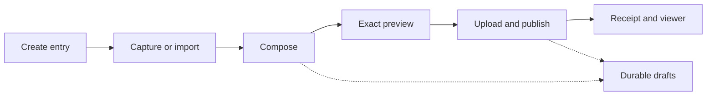

# Create Poster & Create Look — Flagship Creator Department Audit

**Audit date:** 14 July 2026  
**Audited branch:** `coown-master-complete-flagship-reconstruction`  
**Audited HEAD:** `93bcbbd1f87e9a2d624bddd13515c1e3cfb24ec5`  
**Scope:** Create Poster, Create Look, capture/import, composition canvas, layers, templates, drafts, preview, upload, publish, and viewer fidelity  
**Decision:** **Not yet flagship-ready. The stack is capable; the product/editor contract is the limiting factor.**

---

## 1. Executive verdict

The creator department has improved architecturally. It now has a shared document model, pages, layers, undo/redo infrastructure, gestures, templates, local drafts, publish stages, and real upload/API paths. That is meaningful progress.

However, its current visual and product quality is still below Instagram Stories, Meta Edits, Pinterest Collages, and TikTok's creation flows for three reasons:

1. **The editor does not reliably match the published result.** Look collages and Poster layers can be lost, shifted, resized, restyled, or flattened incorrectly after publishing.
2. **The shell still feels like a developer tool wrapped in bottom sheets.** It is not yet an immersive, media-first creation environment.
3. **The media toolchain is shallow.** There is no flagship-grade crop/reframe, trim/timeline, poster-frame selection, cutout, adjustments, safe-zone system, or robust draft/upload recovery.

The immediate priority is therefore **output truth**, not decorative polish. A beautifully styled editor that changes or drops the user's work after publish is a more serious quality failure than an ordinary-looking editor.

### Current quality score

| Area | Current | Flagship target | Main gap |
|---|---:|---:|---|
| Entry and capture | 2.5/10 | 9/10 | Generic action sheet instead of camera/gallery-first entry |
| Canvas and composition | 4.5/10 | 9/10 | Useful base, but card-like canvas and incomplete renderer |
| Direct manipulation | 5.5/10 | 9/10 | Gestures work; handles and discoverability do not |
| Image editing | 2.5/10 | 9/10 | No proper crop, reframe, adjustments, masks, or cutout |
| Video editing | 2/10 | 9/10 | No trim, timeline, audio, captions, or poster-frame control |
| Poster/Story flow | 3/10 | 9/10 | Default ratio defect and no time-based editing model |
| Look/Collage flow | 3/10 | 9/10 | Collage creation exists, but authored result is not rendered by Look detail |
| Publish and recovery | 5/10 | 9/10 | Real stages exist; recovery, validation, and progress are shallow |
| Editor-to-viewer fidelity | 1.5/10 | 10/10 | Published output is not WYSIWYG |
| Accessibility and ergonomics | 3.5/10 | 9/10 | Several controls are too small/dense and gesture-only |
| Visual-system consistency | 3.5/10 | 9/10 | Static colors, rainbow tools, and generic sheets break the app language |
| Visual regression evidence | 1.5/10 | 9/10 | No device-level screenshot or perceptual parity suite |

**Weighted creator-department maturity: approximately 3.7/10.**  
The architecture is more mature than the visible experience, but P0 output defects cap the shippable score.

---

## 2. Direct answer: is the stack the problem?

**No. A rewrite is not justified.**

The current Expo/React Native stack is sufficient to build a competitive 2026 mobile creator:

- React Native + Expo for the native shell and platform integration;
- `react-native-gesture-handler` + Reanimated for UI-thread gestures and responsive manipulation;
- `@shopify/react-native-skia` for a canonical high-fidelity composition renderer and export path;
- `expo-camera` for an immersive in-app camera;
- `expo-image-picker` and `expo-media-library` for library selection, albums, and recent media;
- `expo-image-manipulator` for deterministic crop/rotate/resize operations;
- `expo-video` for playback, frame selection, and editor preview;
- existing haptics, blur, file-system, AsyncStorage, Zustand, and Query infrastructure.

The repository already includes most of these capabilities. The problem is that they are not composed into one coherent creator experience, and the current publish/viewer contracts do not preserve the editor document.

### Stack decision

| Decision | Recommendation |
|---|---|
| Native framework | Keep Expo + React Native |
| Gesture engine | Keep RNGH + Reanimated |
| Composition renderer | Promote Skia to the canonical canvas and export renderer |
| Camera | Use `expo-camera` as a first-class creator surface, not only a picker option |
| Still-image processing | Use ImageManipulator for deterministic crop/rotate/resize; add server-side segmentation for cutout if required |
| Video | Keep `expo-video` for preview; add server-side transcode/thumbnail generation and resumable upload |
| Rewrite in native Swift/Kotlin | Not warranted by the current gap |
| Decorative palette overhaul | Do not do it; retain the neutral flagship palette |

The quality ceiling is being set by **workflow design, renderer ownership, media processing, and contract fidelity**, not React Native.

---

## 3. Audit method and evidence boundary

This report combines:

- static inspection of the active routes, creator components, state, serialization, services, and viewer code;
- top-down review from route → editor → state → upload → API → published viewer;
- bottom-up review from stored API contracts → adapters → renderer → visible result;
- comparison with the supplied reference language: neutral canvas, strong media, restrained chrome, clear hierarchy, large actions, and complete states;
- official July 2026 product/documentation research from Meta, Instagram, Pinterest, TikTok, Expo, Software Mansion, Depop, and Apple.

### Evidence limitation

No live simulator/device capture of the current creator was provided in this workspace. Automated Vitest execution was also unavailable because the checkout's local test installation is incomplete. The present tests are mainly schema/contract assertions, not perceptual device screenshots. Therefore:

- code and contract defects below are directly evidenced;
- visual-quality conclusions are structural/static findings, not claims based on an unobserved rendered screenshot;
- implementation must include device renders and image-diff evidence before it is declared complete.

This limitation is itself a release gap: a flagship visual editor needs repeatable visual QA.

---

## 4. What current flagship creators do differently in 2026

The strongest reference apps do not win through flashy color. They win through a fast media path, confident geometry, contextual tools, output certainty, and a forgiving editing model.

| Reference pattern | What makes it feel flagship | What ThryftVerse should adopt |
|---|---|---|
| Instagram Stories | Full-screen 9:16 media, low chrome, immediate capture, safe placement, contextual stickers, direct preview | Poster must open in true 9:16 with a full-height canvas and safe zones |
| Meta Edits | Project management, frame-accurate timeline, clip editing, captions, color tools, keyframes, high-quality export | Add project/draft recovery, real timeline, trim, text duration, audio, poster frame, and reliable export |
| Pinterest Collages | Cutouts, freeform layers, product-aware objects, rearrangement, remix, drafts, share/export | Make Look a cutout-first shoppable collage product, not a generic layered image |
| TikTok editor | Multi-track editing, clip split/trim, sound/text timing, overlays, smart reframe and captions | Poster needs a temporal model and contextual tool rail rather than static pages alone |
| Depop listing media | Fast capture and professional-grade cleanup tied to a commercial outcome | Add guided product capture, background cleanup, consistent crop, and item-aware tagging |

### Competitive principle

ThryftVerse should not clone one reference. It should combine:

- Instagram's immediacy;
- Edits/TikTok's time-based control;
- Pinterest's collage and product intelligence;
- Depop's commerce clarity;
- ThryftVerse's own neutral, media-first visual identity.

---

## 5. What has genuinely improved

Recent code consolidation is not automatically a downgrade. The unified creator contains several sound foundations:

- one document schema for Looks and Posters;
- multi-page composition;
- normalized layer position and sizing;
- pan, pinch, rotate, tap, double-tap, long-press, snapping, and haptics;
- undo/redo history infrastructure;
- reusable templates;
- local autosave and drafts;
- layer lock, visibility, duplication, deletion, and ordering operations;
- product, mention, Look, text, shape, and interactive Poster object types;
- staged review/upload/publish/success/error UI;
- duplicate-publish protection and upload retries;
- explicit remix metadata.

These are reasons to **repair and elevate the unified creator**, not restore the legacy screens wholesale.

### Safe consolidation versus real regression

| Change type | Interpretation |
|---|---|
| Removing duplicate legacy UI after parity is proven | Healthy simplification |
| Removing old code before active-route parity exists | Regression risk |
| Sharing one canvas and document model | Good architecture |
| Sharing an identical UI for two fundamentally different creation modes | Product-quality regression |
| Fewer lines because rendering is canonical | Good |
| Fewer lines because authored properties are dropped at serialization/view time | Not acceptable |

The branch still contains both active unified code and substantial legacy creator code. Do not use line count as the quality metric. Use creator-to-viewer fidelity, task completion, recovery, and verified device output.

---

## 6. P0 blockers: fix before visual polishing

### P0.1 — Poster's default aspect ratio is internally contradictory

The active empty Poster document is initialized with `16 / 9`:

- [`composition.ts`](../frontend/src/creator/composition.ts) creates Poster documents at `16 / 9`;
- [`CreatorStudioShell.tsx`](../frontend/src/creator/CreatorStudioShell.tsx) computes main canvas height as `width / aspectRatio`, producing a landscape canvas;
- the same shell computes a page thumbnail as `width * aspectRatio`, producing a portrait thumbnail;
- [`CreatorPublishSheet.tsx`](../frontend/src/creator/CreatorPublishSheet.tsx) returns to `width / aspectRatio`, producing landscape preview;
- [`viewerAdapters.ts`](../frontend/src/creator/viewerAdapters.ts) also seeds `16 / 9`;
- the Settings UI correctly defines 9:16 as `0.5625`.

This means the same document can appear portrait in the page strip but landscape in the editor and publish preview. It is a hard correctness failure, not a preference.

**Required fix:**

- establish `aspectRatio = width / height` everywhere;
- default Poster to `9 / 16` (`0.5625`);
- derive all thumbnail, editor, preview, export, and viewer dimensions using `height = width / aspectRatio`;
- migrate old `16 / 9` Poster drafts safely;
- add one contract test that renders the same document dimensions through all five paths.

### P0.2 — Look collage output is discarded by the viewer

[`compositionContract.ts`](../frontend/src/creator/compositionContract.ts) only attaches `compositionDocument` when a Look contains more than one media layer. A single-media Look with text, shape, or decorative layers therefore loses those authored layers immediately.

For multi-media Looks, the document may be sent, but [`LookDetailScreen.tsx`](../frontend/src/screens/LookDetailScreen.tsx) renders only `mediaUrl` and product hotspots. It does not read or render `compositionDocument`. The API-facing `LookApiItem` path also does not provide an end-to-end rendered composition contract to this screen.

The practical result: the creator may show a rich collage, while the published Look shows only the largest media layer.

**Required fix:**

- preserve the composition whenever any visible non-primary layer exists, not only when media count is greater than one;
- include the document or a versioned rendered-output asset in the returned Look contract;
- render the canonical composition in Look detail, feed tiles, profiles, drafts, share previews, and remix;
- retain normalized product positions against the final composition coordinate space;
- generate a stable fallback preview image for old clients and social sharing.

### P0.3 — Poster publish is not WYSIWYG

The Poster serializer/viewer path currently narrows the editor's model:

- only the first media layer on each page becomes the frame media;
- canvas background is not faithfully carried into the output;
- only text with an ID beginning `caption_` becomes the frame caption;
- other editor layers are converted into narrower sticker payloads;
- editor width, height, and opacity are not preserved by the sticker contract;
- editor text modes (`clean`, `headline`, `editorial`, `compact`, `handwritten`) do not match viewer modes (`editorial`, `minimal`, `label`, `outline`);
- decorative layers can be serialized as a text sticker with a shape payload;
- [`PosterStickerLayer.tsx`](../frontend/src/components/poster/PosterStickerLayer.tsx) treats normalized positions as top-left translation, while the creator treats them as layer centers;
- the viewer has no canonical knowledge of the editor's actual layer bounds.

This causes position, scale, style, and content drift after publish.

**Required fix:** choose one canonical strategy:

1. **Preferred:** persist the versioned `CreatorDocument` and render it through the same renderer in editor and viewer, while producing a server-side flattened preview for compatibility; or
2. create a complete, versioned output contract with exact bounds, anchor, opacity, font/style, media crop, background, timing, and interaction metadata.

Do not continue maintaining separate visual interpretations of the same document.

### P0.4 — Some edits bypass undo, dirty state, and autosave semantics

[`CreatorContext.tsx`](../frontend/src/creator/CreatorContext.tsx) tracks transforms through `commitLayerTransform`, but the generic `updateLayer` path only updates state. It does not set `updatedAt`, push history, or mark the document dirty.

Text/media edits invoked through this path can therefore fall outside the expected undo/autosave model.

**Required fix:**

- split preview/transient mutations from committed mutations explicitly;
- every committed property change must update timestamp, history, dirty state, analytics, and autosave scheduling;
- coalesce keystrokes/continuous sliders into one semantic history event rather than one event per frame;
- test back navigation immediately after a text or media edit.

---

## 7. P1 product and visual-quality gaps

### 7.1 Entry is an action sheet, not a creation experience

[`CreatorAssetPicker.tsx`](../frontend/src/creator/CreatorAssetPicker.tsx) presents Gallery, Camera, and Video as generic sheet options. Permission denial can return without a designed recovery state. Image picking is single-select with no recent-media grid, album navigation, crop stage, or limited-library explanation. Video is library-only and has no trim or size/duration guidance.

**Flagship target:**

- tap Create → choose Poster or Look in a fast, visual mode selector;
- immediately show recent media in a 3-column grid with an inline camera tile;
- long-press for preview, multi-select where the mode supports it, and show selected order;
- support albums, search/date grouping if justified, limited-photo access, and “Manage access” recovery;
- allow Poster video recording in-app;
- enter the editor only after media is selected or an intentional blank/template start is chosen.

### 7.2 The editor shell is too crowded and too scroll-driven

The current top bar exposes back, status/title, undo, redo, layers, templates, and drafts. The canvas and selected-layer controls sit inside a keyboard-aware scroll container. This makes a spatial editor behave like a form and allows the canvas to shift while editing.

**Flagship target:**

- persistent, non-scrolling media stage;
- top bar: Back, compact draft status, Preview/Next;
- contextual undo/redo near the active tool or in an overflow/history affordance;
- bottom tool rail changes with selection;
- sheet detents expose detail without moving the canvas unpredictably;
- keyboard adjusts the text tool sheet, not the entire composition stage.

### 7.3 The tool dock looks like a utility/debug toolbar

[`CreatorToolDock.tsx`](../frontend/src/creator/CreatorToolDock.tsx) uses many colored tool icons, tiny labels, and approximately 40-point controls. Color-coding every tool produces a rainbow visual language that competes with the media.

**Flagship target:**

- neutral icons and labels; use one active-state accent;
- minimum 44×44 point hit areas;
- prioritize 4–5 context-relevant tools, move secondary tools to More;
- separate Publish/Next from editing tools;
- replace 10-point permanent labels with a clear selected state and accessible labels;
- keep the neutral palette so the user's media carries color.

### 7.4 Layer controls are overexposed and too dense

[`CreatorLayersSheet.tsx`](../frontend/src/creator/CreatorLayersSheet.tsx) exposes up to eight small actions on every row. This is high cognitive and touch density.

**Flagship target:**

- drag handle for direct reorder;
- thumbnail, layer name/type, visibility, and lock as the primary row;
- duplicate, delete, move-to-front/back, and advanced operations in a row overflow menu;
- multi-select/grouping only after the basic hierarchy is robust;
- 44-point row actions with destructive separation.

### 7.5 Selection handles are visual, not functional

[`CreatorCanvas.tsx`](../frontend/src/creator/CreatorCanvas.tsx) provides sophisticated multi-touch transforms, but visible handles are small and non-interactive. Users must infer two-finger scale/rotate.

**Flagship target:**

- visible corner scale and rotation affordances with large invisible hit zones;
- drag from handles as well as pinch/rotate gestures;
- numeric rotation/scale in a contextual inspector;
- single-tap select, double-tap edit/crop, long-press contextual menu;
- reduced-motion and switch/keyboard-accessible alternatives;
- selection bounds and guides in the canvas coordinate system, not inside a transformed layer coordinate space.

### 7.6 Canvas rendering is visually incomplete

The current canvas is composed from React Native `View`, `Image`, and video layers. Skia is installed but not acting as the canonical renderer. Gradient backgrounds can collapse to a flat primary color. Blanket radius treatment makes content feel cardified and can clip freeform layers.

**Flagship target:**

- one Skia-backed render graph for background, crop, masks, images, text, shapes, selection chrome, and final export;
- real gradient rendering;
- radius only when the layer/frame semantic calls for it;
- deterministic z-order and clipping;
- shared rendering primitives between editor, viewer, thumbnails, and exports;
- preserve image focal points and media crop matrices.

### 7.7 Text is a preset list, not a typography tool

The current four-style text entry and small hardcoded palette are not enough for a premium story/collage product.

**Flagship target:**

- curated, licensed font families with fast preview—not an unbounded font dump;
- scale, alignment, line spacing, letter spacing, color, background, stroke/shadow, and autofit;
- text box bounds and predictable wrapping;
- Poster text duration and entrance/exit animation;
- reusable brand/style favorites later, not in the first repair pass;
- font fallback and export parity tests.

### 7.8 Image editing is missing the quality-making operations

Image selection currently places a full asset but does not provide a flagship crop/reframe workflow.

**Flagship target:**

- double-tap media to enter crop/reframe;
- pan and zoom within the existing frame without changing frame bounds;
- rotate/straighten, flip, replace, reset, and fit/fill;
- exposure, contrast, warmth, saturation, highlights, shadows, and sharpen with reversible parameters;
- background removal/cutout for Looks;
- subject-aware crop suggestions as optional assistance, never destructive automation;
- high-quality preview that uses the same transform in export.

### 7.9 Video is treated as a looping image

Current video handling is primarily preview playback. There is no time-based creation model.

**Flagship target for Poster:**

- thumbnail timeline with scrubber;
- trim handles, split, reorder, duplicate, delete;
- per-page/clip duration;
- text and sticker timing lanes;
- sound mute/volume, music/voiceover foundation, and original-audio policy;
- poster-frame selection;
- automatic caption generation and editable caption timing where backend support exists;
- explicit upload length/size validation before publish.

### 7.10 Templates are generic replacements, not editorial accelerators

The current small card grid applies a template destructively and warns that it cannot be undone.

**Flagship target:**

- editorial collections: Outfit Grid, Product Story, Moodboard, Drop Teaser, Comparison, Before/After;
- filters by Look/Poster, media count, commerce purpose, and format;
- preview against the user's selected media before replacement;
- applying a template must be undoable;
- preserve media/tag intent when switching compatible templates;
- template cards should show the outcome, not merely miniature live canvases.

### 7.11 Drafts are functional but fragile

Drafts are local and media references can point to temporary local URIs. They lack rich recovery and sync states.

**Flagship target:**

- persist media into durable app storage before acknowledging a draft save;
- cloud-sync document metadata and uploaded media when authenticated;
- clear Local, Syncing, Synced, Offline, Needs media, and Failed states;
- show rich thumbnails, type, last edited, duration/page count, and upload state;
- recover after process death, network loss, expired signed URLs, and app upgrade;
- allow explicit duplicate, delete, rename, and resume.

### 7.12 Publish review is incomplete

The current publish sheet has real stages and useful settings, but review lacks the decisions that determine output quality.

**Flagship target:**

- full-screen, exact viewer preview before publish;
- cover/poster-frame selection;
- crop and safe-zone warnings;
- missing-media, unsupported-font, low-resolution, and upload-size checks;
- caption, alt text, audience, replies/reactions, expiry, remix, product tags, and disclosure controls;
- byte-based aggregate upload progress, cancellation, retry, and background continuation;
- success receipt with View, Share, Create another, and Save template.

### 7.13 Back/dismissal semantics are not trustworthy

The dirty-state copy says the work can be saved as a draft, but the native alert options do not provide the promised Save Draft action. The hardware-back hookup also needs runtime validation.

**Flagship target:**

- Back while clean: close immediately;
- Back while dirty: Save draft, Discard, Keep editing;
- saving displays durable success before close;
- gesture-dismiss and Android hardware back follow the same state machine;
- upload/publish dismissal explains background behavior and recovery.

---

## 8. The target creator department

Create Poster and Create Look should share one renderer and document model, but they should **not** be the same product UI with a different title.

### Shared engine

- versioned composition document;
- canonical renderer;
- normalized coordinate model with declared anchor semantics;
- history and autosave;
- durable media manifest;
- upload/retry/cancel pipeline;
- shared accessibility, haptics, safe areas, and theme tokens;
- exact thumbnail, preview, export, and viewer parity.

### Poster-specific product

- 9:16 default, with 1:1 and 4:5 only as intentional alternate distribution formats;
- page/clip strip and timeline;
- capture video/photo in-app;
- duration, sound, text/sticker timing, transitions, and safe zones;
- mention, poll/vote, product, Look, link, and reply interactions;
- 24-hour expiry and highlight/archive behavior;
- full-screen viewer preview.

### Look-specific product

- 4:5 default, with 1:1 and 9:16 alternatives;
- freeform image/product cutouts;
- background removal and edge refinement;
- shoppable product objects that retain listing identity, price, and availability;
- layouts, alignment, spacing, overlap, masks, and editorial backgrounds;
- attribution and remix;
- static share/export and a canonical interactive viewer.

---

## 9. Flagship visual specification

This is a geometry and behavior upgrade, not a champagne-gold reskin.

### 9.1 Canvas and chrome

- Keep a neutral near-black editor chrome in dark mode and neutral white in light mode.
- Let the selected media own most of the first viewport.
- Use edge-to-edge media where safe; avoid placing the editor inside a decorative card.
- Keep all editor controls outside the exported composition.
- Use a subtle single-pixel divider only when it clarifies hierarchy.
- Avoid stacking rounded cards, pills, shadows, and gradients around every action.

### 9.2 Geometry

| Element | Target |
|---|---|
| Top-bar controls | Minimum 44×44 pt hit area |
| Bottom tool controls | Minimum 44×44 pt; 48–52 preferred for primary tools |
| Visible corner handles | 18–22 pt visual with at least 44 pt invisible hit area |
| Sheet corner radius | One restrained system radius; do not nest rounded sheets inside rounded cards |
| Tool gap | 8–12 pt depending on density |
| Canvas side inset | 0–16 pt according to mode; Poster preview should feel full-screen |
| Text minimum | 12 pt for visible UI labels; never rely on 10 pt for core navigation |
| Selected outline | 1.5–2 pt with strong contrast, not glow decoration |

### 9.3 Top bar

**Default:** Back · center draft status · Preview/Next.  
**During selection:** Done · object name · More.  
Undo/redo may remain available, but they should not compete with the primary task.

### 9.4 Contextual bottom rail

**Nothing selected:** Media, Text, Product, Elements, More.  
**Media selected:** Crop, Adjust, Cutout/Trim, Replace, More.  
**Text selected:** Font, Style, Color, Align, Timing/More.  
**Product selected:** Item, Label, Style, Layer, Delete/More.

The rail should be neutral, stable, and tactile. Do not assign a different bright color to every tool.

### 9.5 Sheets

- use medium and expanded detents;
- preserve a visible portion of the canvas at medium detent;
- move to full screen for media library, crop, and timeline tasks;
- keep confirm/cancel semantics consistent;
- maintain keyboard-safe behavior without making the canvas scroll.

### 9.6 Motion and haptics

- 120–220 ms for direct control transitions;
- spring only where spatial continuity benefits;
- light haptic on snap/selection, medium on destructive confirmation, success on publish;
- no decorative entrance animation that delays editing;
- respect reduced motion and avoid looping non-media animation.

### 9.7 Theme discipline

- consume `useAppTheme().colors` rather than static or proposed palette values;
- remove hardcoded creator surface colors unless they are part of the exported artwork;
- no decorative champagne/gold;
- premium quality must survive in pure neutral grayscale through hierarchy, media, typography, and interaction precision.

---

## 10. Code-mapped upgrade plan

| File/system | Required change | Priority |
|---|---|---:|
| [`composition.ts`](../frontend/src/creator/composition.ts) | Normalize ratio semantics; default Poster to 9:16; version and migrate drafts | P0 |
| [`CreatorStudioShell.tsx`](../frontend/src/creator/CreatorStudioShell.tsx) | Non-scrolling stage, simplified top bar, contextual rail, accurate page thumbs, truthful back flow | P0/P1 |
| [`compositionContract.ts`](../frontend/src/creator/compositionContract.ts) | Preserve full document/output properties for both modes | P0 |
| [`LookDetailScreen.tsx`](../frontend/src/screens/LookDetailScreen.tsx) | Render canonical Look composition and maintain product hotspot alignment | P0 |
| [`PosterStickerLayer.tsx`](../frontend/src/components/poster/PosterStickerLayer.tsx) | Align anchor/bounds/text/opacity semantics or replace with canonical renderer | P0 |
| [`CreatorContext.tsx`](../frontend/src/creator/CreatorContext.tsx) | Make every committed edit dirty, historied, autosaved, and timestamped | P0 |
| [`CreatorCanvas.tsx`](../frontend/src/creator/CreatorCanvas.tsx) | Canonical Skia renderer, real gradient, crop matrices, proper guides and handles | P1 |
| [`CreatorAssetPicker.tsx`](../frontend/src/creator/CreatorAssetPicker.tsx) | Recent-media grid, albums, multi-select, camera, permission and limited-access states | P1 |
| [`CreatorToolDock.tsx`](../frontend/src/creator/CreatorToolDock.tsx) | Replace rainbow dock with contextual neutral tool rail and 44+ pt targets | P1 |
| [`CreatorLayersSheet.tsx`](../frontend/src/creator/CreatorLayersSheet.tsx) | Drag reorder, simplified rows, overflow actions, accessible hit targets | P1 |
| [`CreatorTemplateBrowser.tsx`](../frontend/src/creator/CreatorTemplateBrowser.tsx) | Editorial categories, safe preview, undoable application, media-preserving mapping | P1 |
| [`CreatorDraftListScreen.tsx`](../frontend/src/creator/CreatorDraftListScreen.tsx) | Durable media, rich thumbnails, sync/recovery states, consistent aspect math | P1 |
| [`CreatorPublishSheet.tsx`](../frontend/src/creator/CreatorPublishSheet.tsx) | Exact viewer preview, validation, cover, alt text, background upload controls | P1 |
| Upload pipeline | Byte progress, cancellation, resumable/background upload, server processing states | P1 |
| Look API contract | Return composition document/rendered asset and media metadata | P0 |
| Poster API contract | Preserve canonical composition or complete layer geometry/style/timing | P0 |
| Creator tests | Contract parity, device screenshot matrix, interaction tests, recovery tests | P0/P1 |

### Legacy creator policy

The repository still includes legacy `CreatePosterScreen`, `CreateLookScreen`, and older Poster/Look components while active routes redirect to the unified studio.

Do not restore them as parallel product surfaces. Instead:

1. catalogue any capability only present in legacy code;
2. port only missing behavior that still belongs in the target experience;
3. create editor-to-viewer visual parity tests;
4. delete legacy code only after active-route parity and analytics validation;
5. prevent future imports with a lint/test boundary.

---

## 11. Delivery sequence

### Phase 0 — Restore output truth (3–5 engineering days)

- fix Poster 9:16 and ratio formulas;
- repair Look composition persistence and viewer rendering;
- align Poster anchor, bounds, style, opacity, and background semantics;
- repair committed-update history/dirty/autosave behavior;
- introduce golden composition fixtures used by editor, preview, serializer, and viewer tests.

**Exit gate:** the same fixture has identical geometry and content in editor, publish preview, draft thumbnail, and viewer.

### Phase 1 — Recompose the creator shell (4–6 days)

- simplify top bar;
- create fixed stage and contextual bottom rail;
- remove rainbow tool styling;
- normalize 44-point targets, sheets, spacing, and theme consumption;
- make Back/Save Draft truthful;
- add exact Preview mode.

### Phase 2 — Build flagship media entry and editing (5–8 days)

- recent-media grid and albums;
- first-class camera and video capture;
- permission/limited-access recovery;
- crop/reframe/rotate/fit/fill;
- reversible image adjustments;
- durable local media manifest.

### Phase 3 — Elevate Create Look (6–10 days)

- cutout/background removal;
- product-aware layers with availability metadata;
- editorial layouts, masks, overlap, and smart alignment;
- remix/attribution and viewer parity;
- share/export preview.

### Phase 4 — Elevate Create Poster (8–12 days)

- clip/page timeline;
- trim, reorder, duration, poster frame;
- sound and text/sticker timing;
- safe zones and interactive-sticker review;
- full-screen 9:16 viewer simulation.

### Phase 5 — Harden publish and recovery (4–6 days)

- byte-level progress and cancellation;
- resumable/background upload;
- content/media validation;
- cloud draft metadata and explicit sync states;
- publish receipt and failed-processing recovery.

### Phase 6 — Device visual QA (3–5 days)

- iPhone small/standard/large and Android compact/standard device matrix;
- light/dark, keyboard, reduced motion, large text, slow network, offline, and permission states;
- golden screenshots and perceptual thresholds;
- performance profiling on a mid-range Android device.

Estimates assume one experienced React Native engineer with backend/design support. They are sequencing guidance, not a delivery promise.

---

## 12. Definition of flagship-ready

The creator department must not be signed off until all of the following are true.

### Output fidelity

- [ ] Poster defaults to exact 9:16 and uses one ratio convention everywhere.
- [ ] Look defaults to 4:5 and preserves every visible layer.
- [ ] Editor, page thumbnail, draft, publish preview, exported asset, and viewer use the same canonical renderer or a proven equivalent.
- [ ] Position, bounds, anchor, crop, opacity, rotation, scale, font, background, and z-order survive publish.
- [ ] Product hotspots align to the final rendered composition.
- [ ] Old documents are migrated or rendered compatibly.

### Creation experience

- [ ] A user can reach recent media or camera in one intentional step from Create.
- [ ] Media selection includes designed permission, empty, partial-access, error, and retry states.
- [ ] Poster supports trim/duration and text/sticker timing.
- [ ] Look supports crop/reframe and true cutout-based composition.
- [ ] Every visible handle is operable and has a 44-point effective target.
- [ ] Core operations are not gesture-only.
- [ ] Applying a template is previewable and undoable.

### Draft and publish safety

- [ ] Every committed edit marks the document dirty and enters semantic history.
- [ ] Draft media remains available after restart and app update.
- [ ] Back offers working Save Draft, Discard, and Keep Editing options.
- [ ] Upload shows real byte progress, supports retry/cancel, and recovers after interruption.
- [ ] Publish validation catches missing/low-resolution/unsupported media before upload.
- [ ] Success and server-processing failure both have clear next actions.

### Visual quality

- [ ] The canvas dominates; chrome does not compete with media.
- [ ] Toolbars use neutral, restrained styling and a single active-state language.
- [ ] No decorative champagne/gold is required to appear premium.
- [ ] No blanket card, pill, radius, shadow, or gradient treatment.
- [ ] Typography is legible, hierarchical, and identical in export.
- [ ] All creator surfaces consume the runtime theme correctly.

### Accessibility and performance

- [ ] All actions have names, roles, states, and minimum target sizes.
- [ ] VoiceOver/TalkBack can select, reorder, hide, lock, duplicate, and delete layers.
- [ ] Large text does not obscure primary actions.
- [ ] Reduced motion is honored.
- [ ] Pan/scale/rotate stay responsive on target mid-range hardware.
- [ ] Large assets do not block the JS thread or cause full-resolution memory spikes.

### Verification

- [ ] Golden document fixtures cover Look and Poster output.
- [ ] Device screenshots exist for entry, empty, populated, selected, keyboard, preview, uploading, error, and success states.
- [ ] Perceptual visual regression tests run in CI.
- [ ] Contract tests prove viewer parity, not only serializer shape.
- [ ] Manual reference review is based on rendered captures, not code volume or token counts.

---

## 13. Metrics that prove the upgrade worked

Track quality without reducing it to engagement alone:

| Metric | Why it matters |
|---|---|
| Create entry → first media selected | Measures capture/import friction |
| First media → publish-ready preview | Measures editing efficiency |
| Draft recovery success | Measures trust and resilience |
| Upload retry/recovery success | Measures real-world reliability |
| Publish cancellation due to unexpected output | Detects WYSIWYG failures |
| Undo usage followed by successful completion | Validates recoverable editing |
| Permission-denial recovery | Tests designed edge states |
| Look product-tag click-through | Measures commerce usefulness, not decoration |
| Poster completion by page/clip count | Detects timeline overload |
| Crash-free creator sessions and memory warnings | Validates media-engine health |

Also conduct moderated qualitative tests. Ask users to create an outfit collage and a three-part Poster without instruction, then compare the final viewer result with what they believed they made.

---

## 14. Recommended first implementation ticket

**Ticket:** Canonical creator output and 9:16 repair.

### Scope

1. Normalize aspect-ratio semantics and migrate Poster drafts.
2. Persist the full versioned composition for any Look/Poster with authored layers.
3. Render the same composition in editor, publish preview, Look detail, Poster viewer, and thumbnails.
4. Repair `updateLayer` commit semantics.
5. Add two golden fixtures:
   - a 4:5 Look with two images, a cutout placeholder, text, shape, and product tag;
   - a 9:16 Poster with image, styled text, product sticker, rotation, opacity, and duration.

### Why this must come first

It removes the largest trust failure and creates a stable renderer foundation for every later visual upgrade. Reworking toolbars before this ticket would make the editor look more premium while leaving the published output unreliable.

---

## 15. Official research references

- Meta, **One Year of Edits: Built for and With Creators** (22 April 2026): <https://about.fb.com/news/2026/04/one-year-of-edits-built-for-and-with-creators/>
- Meta, **Introducing Edits: A Streamlined Video Creation App**: <https://about.fb.com/news/2025/04/introducing-edits-streamlined-video-creation-app/>
- Instagram, **How to Use Instagram Stories** (2 July 2026): <https://about.instagram.com/blog/tips-and-tricks/how-to-use-instagram-stories>
- Meta Business, **Recommended 9:16 Stories format**: <https://www.facebook.com/business/help/2222978001316177>
- Meta Business, **Stories/Reels aspect-ratio guidance**: <https://www.facebook.com/business/help/103816146375741>
- Meta Business, **Stories safe zones**: <https://www.facebook.com/business/help/980593475366490>
- Pinterest Help, **Create a collage**: <https://help.pinterest.com/en/article/create-a-collage>
- Pinterest Newsroom, **New ways to create and share collages**: <https://newsroom.pinterest.com/news/introducing-new-ways-to-create-and-share-collages/>
- Pinterest Help, **Visual search and cutouts**: <https://help.pinterest.com/en/article/use-visual-search-features>
- Pinterest Help, **Design a Pin**: <https://help.pinterest.com/en/article/design-a-pin>
- Pinterest Help, **Create a Pin from image or video**: <https://help.pinterest.com/en/article/create-a-pin-from-an-image-or-video>
- TikTok Support, **Editing videos and photos**: <https://support.tiktok.com/en/using-tiktok/creating-videos/editing-tiktok-videos-and-photos>
- TikTok Newsroom, **Enhanced editing tools**: <https://newsroom.tiktok.com/en-us/editing-tools>
- TikTok Newsroom, **AI-powered creator tools**: <https://newsroom.tiktok.com/new-ai-powered-tools-to-make-it-easier-to-create-and-share-on-tiktok?lang=en>
- Depop Help, **How to list an item**: <https://depophelp.zendesk.com/hc/en-gb/articles/360032716413-How-to-list-an-item>
- Depop Newsroom, **Photoroom professional-grade photo editing integration**: <https://news.depop.com/>
- Expo, **Camera**: <https://docs.expo.dev/versions/latest/sdk/camera/>
- Expo, **ImagePicker**: <https://docs.expo.dev/versions/latest/sdk/imagepicker/>
- Expo, **ImageManipulator**: <https://docs.expo.dev/versions/latest/sdk/imagemanipulator/>
- Expo, **MediaLibrary**: <https://docs.expo.dev/versions/latest/sdk/media-library/>
- Expo, **Video**: <https://docs.expo.dev/versions/latest/sdk/video/>
- Software Mansion, **React Native Gesture Handler**: <https://docs.swmansion.com/react-native-gesture-handler/>
- Apple, **UI design tips and 44-point touch targets**: <https://developer.apple.com/design/tips/>

---

## Final product direction

Do not turn the creator gold, glassy, or overdecorated. Make it **quiet, immediate, spatial, recoverable, and exact**.

The flagship experience is:

> select media quickly → manipulate it directly → understand every control → preview the exact outcome → publish without losing work → see the same composition everywhere.

That is the quality threshold the current creator must cross before surface-level polish can honestly be called production-ready.
