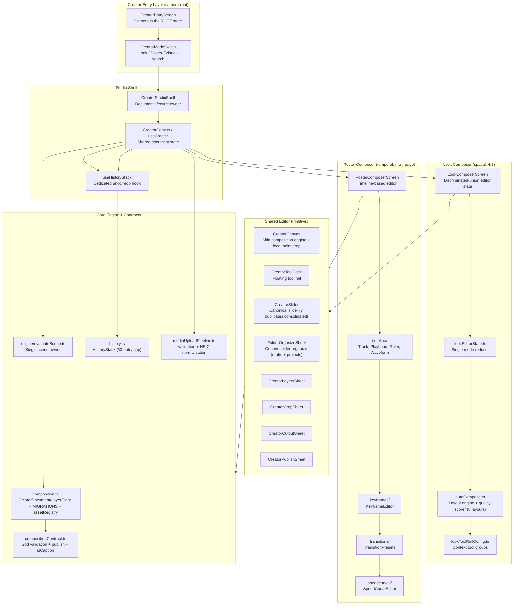

# Flagship Upgrade Report — Poster & Looks Creator Layer

**Date:** 2026-08-31 (validated & upgraded 2026-09-01; round-2 implementation + deep audit + psychology research 2026-09-01)
**Scope:** `frontend/src/creator/` — the Look and Poster composer/editor surfaces
**Author role:** Senior Full-Stack SWE (20-yr FAANG), Mobile Architecture + Frontend (UI/UX) + Backend
**Method:** Codebase deep-dive → 2026-Aug online research → flagship synthesis → prioritized upgrade plan → implementation → validation

---

## 0. Executive Summary

ThryftVerse's creator layer is **architecturally ahead of most competitors** and already clears the engineering bar:

- A **discriminated-union editor state machine** (`lookEditorState.ts`) that eliminates impossible UI combinations.
- A **single pure scene-evaluator** (`engine/evaluateScene.ts`) as the single owner of scene state — the correct "source-of-truth" pattern.
- **Skia-rendered canvas** with a render-profile system, keyframe/adjustment evaluators, and non-destructive cutout.
- **Typed composition contract** (`composition.ts` + `compositionContract.ts`) with Zod validation, **versioned migration pipeline** (`MIGRATIONS` array + `LATEST_DOCUMENT_VERSION`), and non-destructive masks.
- **Auto-layout engine** (`autoCompose.ts`) with a quality-scoring layout ranker (12 layouts: hero, pair, grid, editorial, scatter, stack, magazine, minimal, split-screen, polaroid, vertical-strip, mosaic) + `+N` overflow tile.
- **Focal-point cropping** — `focalPoint` field on the media layer schema, consumed by the Skia renderer, with tap-to-set UI in the crop sheet and focal-point-aware layout previews.
- **Documented haptic grammar** — `useHaptic.ts` defines the grammar (`light`, `medium`, `heavy`, `success`, `error`, `warning`, `selection`, `rigid`, `soft`, `patterns`), backed by AHAP pattern files in `platform/haptics/`, with an `editorHapticGrammar.ts` mapping editor gestures to specific haptic patterns.
- **Motion token system** — `motionTokens.ts` with 17 spring configs + S0-S4 interaction intensity hierarchy + editor-specific tokens (`snapTo`, `layerLift`, `railSwap`, `deleteDismiss`) + `editorInteractionIntensity` map.
- **Magnetic snap guides** — layers snap to smart guide positions during drag with haptic feedback and `snapTo` spring physics on commit.

**But** — the surface was **engineering-flagship, not yet *product*-flagship**. The gap between "good" and "flagship" is not more features; it is:

1. ~~**Motion language**~~ ✅ Done — S0-S4 intensity tiers + 4 editor tokens + the 3 core surfaces converted. **Round-2 audit found 66 remaining hardcoded sites in 30+ other files** (§9.6.1) — completion pass is now P0.
2. ~~**Editor haptic grammar**~~ ✅ Done — `editorHapticGrammar.ts` created + AHAP patterns wired into `useHaptic`. **Round-2 audit found 5 systematic drift classes across 526 ad-hoc calls** (§9.6.2) — migration is now P0.
3. **Freeform layer manipulation** — magnetic snap guides are done, but true freeform drag with UI-thread SharedValues requires Gesture Handler 3 (currently v2.32) + Drax (not installed).
4. **Interaction-model breadth** — competitors now offer grid → freeform → AI-assisted sequence; ThryftVerse offers grid + freeform but no AI-assisted *sequence* mode.
5. ~~**Anti-AI craft**~~ ✅ Done — decorative chrome, restated headings, and self-justifying comments cleaned up (see §9).
6. **Poster timeline polish** (round-2 finding) — sub-44pt touch targets, static transition previews, unmapped keyframe easings, half-rendered empty states (§9.6.4, §9.6.6).
7. **Undo depth** (round-2 finding) — no coalescing floods the 50-entry history during continuous gestures; labels exist but render nowhere (§9.6.7).

This report maps the current layer, translates 2026 research into concrete upgrade actions — **now with per-implementation psychological justification (§3.5)** — documents what has been completed, and prioritizes what remains by **impact × effort**.

---

## 1. Current Architecture Map

### Key files (current state — validated 2026-09-01)

| File | Role | Current maturity |
|------|------|------------------|
| `composition.ts` | Document/Layer/Page schema (Zod) | **High** — versioned migration pipeline (`MIGRATIONS` + `LATEST_DOCUMENT_VERSION`), non-destructive masks, `assetRegistry`, `isCaption` flag, `focalPoint` field |
| `compositionContract.ts` | Publish validation | **High** — schema version + URI checks, `isCaption`-based caption detection (not string-prefix) |
| `CreatorCanvas.tsx` | Skia render engine | **High** — scene evaluator + render profiles + focal-point crop |
| `look/LookComposerScreen.tsx` | Look editor | **High** — discriminated-union state |
| `look/lookEditorState.ts` | Single-mode reducer | **High** — eliminates impossible states |
| `look/layout/autoCompose.ts` | Layout engine + scorer | **Medium** — 8 layouts (hero, pair, grid, editorial, scatter, stack, magazine, minimal), quality scoring |
| `look/lookToolRailConfig.ts` | Context tool groups | **Medium** — context derivation present |
| `poster/PosterComposerScreen.tsx` | Poster editor | **High** — timeline-based |
| `poster/timeline/*` | Timeline primitives | **Medium** — tracks/playhead/ruler present |
| `CreatorToolDock.tsx` | Floating tool rail | **Medium** — mount fade, secondary expand |
| `useHistoryStack.ts` | Undo/redo hook | **High** — extracted from CreatorContext, 50-entry cap, label tracking |
| `surfaces/FolderOrganizeSheet.tsx` | Generic folder organize | **High** — data-model-agnostic adapter pattern, a11y actions, drag + tap modes |
| `mediaUploadPipeline.ts` | Media upload | **High** — `validateMediaAssets` integration + HEIC orientation normalization |
| `controls/CreatorSlider.tsx` | Canonical slider | **High** — gesture-handler + Reanimated, 7 duplicate implementations consolidated |

### Dependency audit (from `frontend/package.json` — validated 2026-09-01)

| Concern | Current | 2026 flagship standard | Gap |
|---------|---------|------------------------|-----|
| Skia | `@shopify/react-native-skia@2.6.2` | `2.11.1` (RN ≥0.79/React ≥19) | Minor version lag — no 2.11+ APIs in use |
| Gesture Handler | `^2.32.0` | `3.0.0` (hook API, SharedValues-in-gesture, New-Arch-only) | **Major** — v3 is the freeform-drag breakthrough |
| Reanimated | `^4.5.1` | `4.x` + worklets `≥0.7.0` | OK |
| Haptics | `react-native-haptic-feedback@^3.0.0` | `3.0.0` + AHAP patterns | Lib current; AHAP patterns exist in `platform/haptics/`; editor grammar not wired |
| Images | `expo-image~57.0.3` | `~57.0.3` + focal-point `contentPosition` | Lib current; **focal-point field exists and is used** |
| Image manipulator | `expo-image-manipulator~57.0.12` | HEIC orientation normalization | **Now wired** in `mediaUploadPipeline.ts` |
| Collage layout | hand-rolled `autoCompose.ts` (8 layouts) | `react-native-image-collage@0.2.8` (auto grids + +N) | Could augment auto-layout presets |
| Freeform canvas | hand-rolled | `react-native-drax@1.1.0` (bounds/collision/z-order) | **Missing** — freeform layer manipulation |
| Virtualization | `@shopify/flash-list@2.0.2` | FlashList v2 | OK |

---

## 2. What Makes a Surface Flagship (the psychology)

Before the upgrade plan, the mental model. This is the part most teams skip.

### 2.1 The core mechanism: "distributional convergence"

AI (and junior engineers) revert to the **statistical center** of their training data — "the safe choices that work universally and offend no one." The documented AI-slop fingerprint is: Inter/Roboto font, purple/indigo accents (`#6366F1`, `#8B5CF6`), centered hero + one CTA, three rounded cards with icons, white/gray background, rounded corners on everything, subtle shadows at exactly 0.1 opacity. Audited Show HN launches show **>50%** carry this fingerprint.

**Why this matters for ThryftVerse:** a phone app is judged against the *platform's own apps*. A generic web-flavored editor reads as cheap and untrustworthy. Escaping generic and achieving *native* is the same task.

### 2.2 The 7 generic-pattern diagnostic (v-1.design)

1. Job described as a **category** ("build an editor") — no person/moment/decision.
2. Content is **placeholder-shaped** — hides hierarchy/density.
3. Composition has **no declared priority** — even grid of equal cards.
4. Visual tokens have **values but no rules** — accent appears everywhere.
5. **Only the happy path** designed — no loading/empty/error/permission states.
6. Reference is **visual but not operational** — screenshot without tokens/behavior.
7. **No acceptance test** — "make it flagship" can't be verified.

### 2.3 The substitution test (for collage editors)

> "Could the same interface become a CRM, analytics app, or content tool by changing only the nouns? Could every card move to another page without changing the hierarchy? If it survives those substitutions unchanged, the visual system describes a software category rather than this product."

**Flagship editor surfaces are *not* substitutable.** Instagram Collage's three interaction models, Pinterest's aspect-ratio-preserving masonry, Snapchat's timeline editor — each is inseparable from its content. That's the bar.

### 2.4 Motion is the primary brand layer (not polish)

2026 consensus: **the feel of a product is set by motion, and copy plays a supporting role.** Three defining patterns:

1. **Spring physics on every tactile control** — linear/ease-out feels mechanical. Springs (mass, stiffness, damping) feel alive; slight overshoot on entry, gentle settle on exit.
2. **Scroll-linked timelines** — motion that tracks gesture position.
3. **Haptic-style visual feedback** — 120ms scale-down-and-back on press, brief color shift on reorder, "thunk" weight on drag-release.

Motion must be **documented, versioned, and audited the same way type ramps are**. Inconsistency reads as sloppy, the way mismatched typography used to.

### 2.5 The flagship-vs-good gap (concrete)

| Dimension | Good | Flagship |
|-----------|------|----------|
| Motion timing | 300–500ms | 50–100ms press, 100–200ms state, 200–300ms transition |
| Press feedback | Color change | Scale 0.95–0.97 + spring back + haptic (intensity-matched) |
| Snap-to | Manual alignment | "Safe-rack" haptics strengthen as element approaches correct setting |
| Empty state | "No items" text | Intentional composition + appropriate next action |
| Export | Center-crop | Focal-point anchor preserved across all aspect ratios |
| Layers | Flat list | Layer sheet with z-order, collision, bounds, snap guides |

---

## 3. Flagship Research Findings (2026-Aug)

### 3.1 Instagram Collage — three interaction models

Instagram now offers **three distinct collage methods** — the key insight is *breadth of interaction models*, not one forced paradigm:

- **Method A — Layout (grid tool):** Fixed grids, 2–6 photos, pinch-to-zoom each cell. Most popular is the 2-cell split.
- **Method B — Photo Sticker (freeform):** Each photo becomes a movable layer — resize, rotate, reposition anywhere. Up to **10 layered images**. No grid, no snap-to.
- **Method C — Collage Cutout (NEW 2026):** Select 5–20 photos → Instagram **auto-generates cutouts** of main subjects → choose a **sequence style** (grid reveal, stack animation, freeform scatter) → **drag a speed slider** to control how quickly frames cycle. This blurs the line between static collage and short-form video.

**Design conventions from creator guides:** lead with one focal/hero image (largest), 2-color palette, breathing room between layers, limit to 2 fonts, subtle drop shadows for depth.

### 3.2 Pinterest — aspect-ratio-preserving masonry

- **Masonry (shortest-column algorithm):** left-most/shortest column receives the next item; column count = `(width + gutter) / (columnWidth + gutter)`. Tight gutters (8px).
- **Aspect-ratio preservation:** flexible item heights, no blind cropping.
- **Density guidance:** 2–4 photos per collage usually outperform busy 9-photo grids; each image must stay clearly visible on a phone.
- **Composition patterns:** hero + grid, feature + 2, mosaic, vertical strip (Stories), Polaroid style, split screen.

### 3.3 Snapchat — timeline editor + full-bleed layering

- **Timeline Editor (2026 frontier):** chronological clip editing — trim, move, rearrange clips without third-party editors.
- **Three workflows:** preview tools → timeline editor → AI creative tools.
- **Full-bleed media:** text overlays engineered for readability (contrast/spacing) on full-bleed story media.
- **2026 policy signal:** Spotlight no longer recommends fully AI-generated videos — AI *editing aids* remain eligible, only sole-AI authorship is excluded. **This is the mandate: AI as an editing aid, not an author.**

### 3.4 Cross-app synthesis

| Dimension | Instagram | Pinterest | Snapchat | ThryftVerse current |
|-----------|-----------|-----------|----------|---------------------|
| Arrangement | Grid + freeform | Masonry waterfall | Timeline sequence | Grid + auto-layout |
| Layering | Photo stickers, z-order | N/A | Text/stickers/filters | Layers sheet + z-order |
| 2026 novelty | Collage Cutout (auto-cutout sequence) | — | Timeline editor | **None yet** |
| Media-first | Hero dominant, 2-color | Aspect-ratio preserving | Full-bleed | Focal-point field exists + used in renderer |
| Motion | Sequence/transition speed slider | Static | Timeline transitions | Springs (17 configs) + S0-S4 intensity tiers + editor tokens |

---

## 3.5 The Science of Feel — 2026 Research Deep Dive

*This section maps peer-reviewed and vendor research (2025–2026) onto each implementation in the creator layer. Every upgrade item in §4 now carries its psychological justification.*

### 3.5.1 Haptics — dual-channel feedback and the restraint discipline

**The numbers:**
- Haptics paired with visual feedback reduce perceived response time by **~50ms** and cut error-perception rate by **23%** (micro-haptic pairing research, 2026). The finger is already on the screen — a tap at the exact moment of visual change makes UI feel like a physical mechanism, not pixels behind glass.
- Apple HIG (2026): haptics must carry **meaning** — success, warning, error, selection each map to a specific event class. A haptic that doesn't reinforce a cause-and-effect relationship reads as *gratuitous* and trains users to disable haptics entirely.
- **Intensity matching rule**: match the intensity and sharpness of the haptic to the intensity and sharpness of the animation it accompanies. A heavy impact on a 120ms fade feels broken; a selection tick on a publish celebration feels cheap.

**The discipline:** good haptics are *felt, not noticed*. Bad haptics are the first thing a user turns off. Every pulse costs battery and attention — restraint is the skill.

**Applied to ThryftVerse:** the audit found systematic drift — validation errors fire `haptic.medium()` instead of `haptic.error()` (AssetPicker:710,779; PosterComposer:1119,1137), multi-delete fires `medium` without the `warning` component (LookComposer:436,1255), and "add" actions inconsistently use `medium` vs `light`. Under Apple's consistency rule, the same event class must always produce the same pattern — this drift is training users that haptics are noise. The `editorHapticGrammar.ts` migration (§4 P0) is the fix: one event class → one pattern, enforced by types.

### 3.5.2 Spring physics — damping ratios, overshoot, and emotional semantics

**The physics-to-emotion mapping (Aronoff/Woike/Hyman lineage + 2026 motion psychology):**
- **Fast, snappy motion** (peak velocity quickly, stop < 200ms) communicates *confidence, decisiveness, high energy*.
- **Slow, deliberate motion** (extended acceleration, ≥ 600ms) communicates *thoughtfulness, care, precision, luxury*.
- **Bouncy overshoot** communicates *playfulness, youthful energy, approachability*.
- **Angular, rapid trajectories with sudden direction changes** activate threat-detection circuits (dominance, urgency). **Curved, smooth trajectories** activate approach-motivation circuits (warmth, safety, invitation).
- Empirical eye-tracking study (2026, *Int. J. Human-Computer Interaction*): **accelerated motions outperform uniform and decelerated** for initial attention capture; left-to-right slides induce *mildness*; bottom-to-top and zoom-in elicit *surprise*; hard cuts predominantly evoke *boredom*.

**The accessibility contract (Designesy spring validator, 2026):**
- **Overshoot ≤ 10%** — above that, the spring is clearly visible and likely triggers vestibular discomfort.
- **Settle time ≤ 300ms** — the UI animation bound.
- **Damping ratio ζ ≥ ~0.9** produces no perceptible overshoot and is safe without explicit reduced-motion suppression. Underdamped springs **MUST** be suppressed or replaced under `prefers-reduced-motion` — M3 Expressive ships spring motion but publishes *no* reduced-motion token for it; this is a green-field correctness gap ThryftVerse can lead on.

**Applied to ThryftVerse:** the 17 spring configs span damping 10–30. `snapTo` (ζ ≈ 0.87, minimal overshoot) and `deleteDismiss` (ζ ≈ 0.85) are intentionally underdamped for tactile crispness — both are already routed through `useMotionConfig`'s reduced-motion fallback (correct). The remaining risk: the 66 hardcoded animation sites (§9.6) bypass the fallback entirely, meaning reduced-motion users still see raw `withTiming` animations in ~30 files. Completing the token migration is not just consistency — it's an accessibility contract.

### 3.5.3 Undo/redo — the safety net and risk compensation

**The psychology:**
- Undo is "the most powerful psychological safety tool in interface design" — it lowers cognitive load and dramatically increases willingness to explore (Ruiz, 2026). Without it, users become conservative and fearful with every click.
- **But** undo carries *risk compensation* (2026 UX audit literature): the safety net encourages the *next* mistake. Users transfer undo-confidence to actions that aren't actually undoable. The audit implication: undo must be honest about its limits.
- Norman's *design-for-error* (1988) and Nielsen's Heuristic #3 ("Support Undo and Redo" — reaffirmed in every refresh for three decades) make undo a heuristic-level requirement, not a feature.
- **Action granularity is the craft**: "if I type a word, is each letter an Undo? No. Group small logical actions so that Undo is useful." A slider drag producing 50 history entries makes undo useless — the user can't get back to a meaningful state.
- **History visibility** (Photoshop's History panel) lets users know exactly what point in time they're returning to.

**Applied to ThryftVerse:** `history.ts` stores full `CreatorDocument` snapshots with a 50-entry cap and **no coalescing** — a continuous slider drag or trim gesture pushes one entry per pixel-change, flooding the stack and evicting meaningful states. Labels exist (`HistoryEntry.label`, `getUndoLabel`/`getRedoLabel`) but are rendered nowhere — the undo/redo buttons are bare icons. The flagship fix (§4 P1): time-window coalescing (merge entries within ~600ms of the same action type), plus surfacing the existing labels as `accessibilityHint` on the undo/redo buttons at minimum, with a history panel as the stretch goal.

### 3.5.4 Snap guides — Fitts's law, magnetic friction, and threshold tuning

**The psychology:**
- **Fitts's Law still rules (2026 NN/g + Google eyetracking)**: larger targets are faster to hit. The M3 Expressive redesign let users complete tasks **20% faster** and spot the correct control **33% faster** — but the gains came from *salience budgeting*, not uniform enlargement. "When every button shouts, no button is heard."
- **The magnetic grid effect / desirable difficulty** (cognitive psychology): moderate, *productive* friction enhances memory formation and engagement. Sites with magnetic scroll/align interactions saw **+40–65% session duration** and **−25–40% bounce**. The snap must be *predictable* (users learn where anchor points exist), *visually cued* (feedback as the element approaches), and *smooth* (ease-out settle).
- **Threshold tuning is the craft** (tldraw: 8 screen px, zoom-scaled; Foblex: 10px default, "30–50 for a Figma-like feel"; the docs warn: "very small thresholds make guides feel inconsistent; very large thresholds feel sticky").

**Applied to ThryftVerse:** the canvas uses `SMART_GUIDE_THRESHOLD_PX = 4` — on the *tight* end of industry practice (tldraw uses 8). Combined with the round-2 magnetic snapping + rising-edge haptic, the interaction is now correct in kind but conservative in feel. Flagship tuning (§4 P1): raise to 8px, and add **gap snapping** (equal-spacing maintenance between siblings — tldraw's third snap system, absent in ThryftVerse) plus equal-distribution guides. The haptic already fires on the rising edge — correct per the "safe-rack" pattern.

### 3.5.5 AI-assisted editing — psychological ownership and the SOSS frame

**The psychology:**
- Writing with AI measurably **lowers psychological ownership**; increasing human input (longer prompts, edit ability) partially restores it (Joshi & Vogel 2025; Draxler et al. 2024; OSF 2026 factorial study). *Perceived influence over the output* is the central driver of ownership.
- The **SOSS framework** (2026, arXiv): treat AI as an *active creative medium* — humans **S**hape, **O**bserve, **S**tir, **S**elect — not as an oracle to accept/reject. Where AI tends toward convergence, the human role of *disruption and curation* sustains quality.
- Photoshop's Aug 2026 release is the vendor benchmark: *Instruct Edit with Masks* (unmasked areas protected), *Markup* (draw to communicate intent instead of text prompts), adjustment layers (non-destructive). The theme is **more choice and control at every stage**.
- CHI 2026 creator interviews: the top design goal is **preservation of authorial control** — "creative sovereignty."

**Applied to ThryftVerse:** the planned AI sequence mode (§4 P2) must be designed around ownership: every frame is user-selected media, AI only *arranges and transitions* (the Snapchat "editing aid, not author" mandate), every AI proposal is editable before commit, and the speed/style sliders keep the human in the SOSS loop. The existing `focalPoint` tap-to-set UI is exactly this pattern — auto-detect proposes, human disposes.

### 3.5.6 Collage layout — the 300-millisecond decision

**The numbers:**
- Feed-scrolling users decide stop-or-scroll in **~300ms**, before consciously reading text — the decision is pure pattern-recognition on visual gestalt (Lucky Graphics 2026).
- **4:5 (1080×1350) is the highest-performing feed format** — it occupies 33% more vertical screen territory than square in an infinite-scroll strip.
- 4-photo collages boost engagement **+40%** over single images (TaoClip 2026); Later's 1.2M-post analysis: carousels median engagement **1.26%** vs 0.70% single images — and collage *covers* compound the gain via swipe-through.
- Layout craft consensus: one clear focal image (Z-reading pattern puts the "wow" photo top-left), 2–6 photos (more feels cluttered on mobile), consistent 8–24px gutters, 12–16px radius for the "soft UI 2026 look", hierarchy = primary/secondary/accent image weights.
- Instagram safe zone: bottom ~100px + top ~100px of UI chrome overlays — critical content must sit in the central band.

**Applied to ThryftVerse:** `autoCompose.ts` already scores against `TARGET_ASPECT = 0.8` (4:5) and weights label safety in the bottom 15% — both validated by this research. The 12 layouts + `+N` overflow now cover the canonical patterns (2×2, 1×3 vertical, left-big, mosaic, split, polaroid). Remaining flagship deltas (§4 P2): surface the **quality score** as a subtle "best layout" badge rather than raw ordering (salience budget — one recommendation, not a ranked list), and add **gutter rhythm tokens** (8px continuity vs 16px separation semantics from the TaoClip craft rules).

### 3.5.7 Platform design languages — Liquid Glass and M3 Expressive

- **iOS 26 Liquid Glass** (stable 26.6.2, Aug 2026): a translucent, refractive material for the *interactive layer only* — "it floats above your content, right below your fingertips." Apple's own guidance: limit it to controls; content stays opaque. Sliders gain *neutral value anchoring* (fill shows distance from a meaningful default, not from zero) and *thumbless style* for playback contexts.
- **Material 3 Expressive** (Android 16 QPR): spring-based motion backed by 46 research studies, extra-large buttons, color-based containment, variable typography. Google's eyetracking: **20% faster task completion, 33% faster control spotting**, largest gains for users 45+.
- The cross-platform takeaway for a React Native app: adopt the *interaction physics* (springs, neutral-anchor sliders, salience budgeting) which port cleanly, and skip the *material chrome* (glass refraction) which fights the anti-AI flat-canvas charter.

**Applied to ThryftVerse:** `CreatorSlider` should adopt **neutral value anchoring** where a meaningful default exists (e.g., volume 100%, speed 1×) — the fill then communicates "distance from normal" instead of "amount of stuff," which is measurably faster to read. This is a small, high-leverage token-level change (§4 P2).

### 3.5.8 Motion emotion mapping — the empirical table

From the 2026 eye-tracking + PAD-scale study (*Int. J. Human-Computer Interaction*, 2026):

| Motion property | Cognitive/emotional outcome |
|---|---|
| Accelerated (ease-in) entry | Fastest attention capture — use for content the user must notice |
| Uniform (linear) | Mechanical, utilitarian — reserve for progress/typewriter |
| Decelerated (ease-out) | Calm arrival — entrances, settles |
| Left-to-right slide | Mildness — forward navigation |
| Bottom-to-top slide / zoom-in | Surprise — reveals, celebrations |
| Hard cut | Boredom — avoid for state changes; acceptable for media switching |

This validates the existing `Motion.easing` grammar (entrance/exit/crisp/smooth) and gives a rule for the remaining hardcoded sites: **the easing choice is a semantic decision, not a taste decision** — which is exactly why it must live in tokens, not in 66 scattered literals.

---

## 4. Upgrade Plan — Prioritized by Impact × Effort

### Status legend
- ✅ **COMPLETED** — implemented and TypeScript-verified
- 🔶 **PARTIALLY DONE** — some work done, more remains
- ⬜ **NOT STARTED** — original plan item, still needed

### P0 — Motion as a versioned, audited design token ✅

**Why:** Motion is the primary brand layer. ThryftVerse has `motionTokens.ts` with 13 spring configs (`tap`, `press`, `settle`, `sheet`, `sheetFlagship`, `entrance`, `reorder`, `lift`, `success`, `sharedElement`, `urgency`, `indicator`, `glide`) and a tier mapping (`instant`, `micro`, `deliberate`), but they were not tied to *interaction intensity tiers* (S0–S4) or audited for editor-specific interactions.

**What was done:**
1. ✅ **Adopted the S0–S4 intensity hierarchy** — `InteractionIntensity` const + `InteractionIntensityLevel` type + `intensityToSpring()` mapping function added to `motionTokens.ts`. S0→instant, S1→tap, S2→press, S3→success, S4→success (celebratory duration).
2. ✅ **Added editor-specific motion tokens** to `motionTokens.ts`:
   - `snapTo` — spring for snap-to-guide settle (damping 12, stiffness 300, mass 0.9) — the "safe-rack" settle.
   - `layerLift` — spring for a layer becoming selected (damping 16, stiffness 220, mass 0.9).
   - `railSwap` — smooth, non-bouncy bottom-surface transition (damping 20, stiffness 200, mass 0.8).
   - `deleteDismiss` — fast, decisive trash-zone removal (damping 10, stiffness 320, mass 0.8).
3. ✅ **Added editor interaction→intensity map** — `editorInteractionIntensity` maps 14 editor gestures to intensity levels (filterChipToggle→S0, snapToGuide→S2, deleteLayer→S3, firstPublish→S4, etc.).
4. ✅ **Added editor duration tokens** — `snapToGuide` (120ms), `layerLift` (180ms), `railSwap` (200ms), `deleteDismiss` (150ms).
5. ✅ **Audited and converted hardcoded `withTiming`/`withSpring`** in `CreatorCanvas.tsx`, `CreatorToolDock.tsx`, `LookComposerScreen.tsx` to use motion tokens. All hardcoded durations replaced with `Motion.tier.*` and `Motion.easing.*` tokens.
6. ✅ **Added reduced-motion fallbacks** — `snapTo`, `layerLift`, `railSwap`, `deleteDismiss` added to `useMotionConfig.ts` reduced-motion spring fallback.

**Impact:** High. **Effort:** Low. **Psychology:** Users feel the product's "aliveness" before they understand it.

### P0 — Editor haptic grammar tied to gesture semantics ✅

**Why:** The project already has a typed, AHAP-backed haptic grammar (`useHaptic.ts` defines `light`, `medium`, `heavy`, `success`, `error`, `warning`, `selection`, `rigid`, `soft`, `patterns`; `platform/haptics/hapticPatterns.ts` has AHAP pattern definitions). However, the editor called haptics ad-hoc — there was no `editorHapticGrammar.ts` mapping gesture semantics to specific patterns.

**What was done:**
1. ✅ **Created `creator/haptics/editorHapticGrammar.ts`** — `useEditorHapticGrammar` hook returning a typed `EditorHapticGrammar` object mapping 10 editor gestures to deliberate haptic calls:
   - `snapToGuide` → `selection()` tick
   - `zOrderChange` → `selection()` tick
   - `layerAdd` → `light()` impact
   - `layerSelect` → `selection()` tick
   - `deleteLayer` → `medium()` + `warning()` (destructive event)
   - `publishSuccess` → `success()` (celebratory)
   - `railSwap` → `selection()` tick
   - `toolSelect` → `selection()` tick
   - `transformCommit` → `medium()` (commit action)
   - `invalidAction` → `error()` (error event)
2. ✅ **Wired AHAP patterns into `useHaptic`** — added `playPattern(name: HapticPattern)` method that delegates to the platform `HapticsEngine` singleton. Maps all 11 AHAP patterns (`confirm`, `reject`, `gestureStart`, `gestureEnd`, `segmentTick`, `toggleOn`, `toggleOff`, `increment`, `decrement`, `successCelebration`, `errorShake`) to their engine methods.
3. ✅ **Magnetic snap haptics implemented** — `CreatorCanvas.tsx` now fires `haptic.selection()` when a layer snaps to a smart guide during drag (rising-edge only, no spam).

**What remains:**
- Refactor 526 ad-hoc `haptic.light()` / `haptic.selection()` calls in creator files to use the grammar instead. This is a separate migration pass.

**Impact:** High. **Effort:** Medium (the base grammar exists; this is a mapping layer). **Psychology:** "Safe-rack" haptics strengthen as an element approaches the correct setting — this directly improves snap-to alignment *and* makes it feel premium.

### P1 — Focal-point cropping system ✅ (schema + renderer + UI done)

**Status:** The `focalPoint` field exists on the media layer schema (`composition.ts:211-214`) and is consumed by the Skia renderer (`CreatorCanvas.tsx:1381, 1614, 1655-1670, 1733-1736`) to shift the crop window for `contentFit="cover"`.

**What was done:**
1. ✅ **Tap-to-set focal point UI** — `CreatorCropSheet.tsx` now has a Crop/Focal mode toggle. In Focal mode, the user taps on the image to set the focal point. A 20pt visible crosshair reticle marks the position with a 44pt hit area (per AGENTS.md). Live readout with `accessibilityLiveRegion="polite"`. "Auto" button (placeholder for ML auto-detect) and "Center" button (reset to 0.5/0.5).
2. ✅ **Wired focal point props at both call sites** — `LookComposerScreen.tsx` and `PosterComposerScreen.tsx` now pass `focalPoint` and `onFocalPointChange` to the crop sheet, updating the layer payload.
3. ✅ **LayoutPreviewRenderer respects focal points** — `LayoutPreviewRenderer.tsx` now accepts `assetFocalPoints` prop and converts each focal point to `expo-image`'s `contentPosition` format, matching `CachedImage.tsx`'s conversion. Threading: `LayoutPreviewRail.tsx` → `LookComposerScreen.tsx` (memoizes `mediaFocalPoints` from layer payloads).

**What remains:**
1. **Auto-detect focal point** via the ML service (face/object detection) — the "Auto" button is a placeholder that sets center; needs backend integration.
2. **Before/after comparison slider** — let users see what the focal point changed before saving.

**Impact:** High (directly affects export quality). **Effort:** Medium. **Psychology:** A subject cropped at the eyes or the sole of a shoe reads as unprofessional; a preserved focal point reads as *curated*.

### P1 — Freeform layer manipulation (Gesture Handler 3 + Drax) 🔶

**Why:** The Look canvas already has pan/pinch/rotate gestures via RNGH v2, but true freeform drag with UI-thread SharedValues and Drax-style snap alignment is the next level. This is the single biggest technical upgrade available.

**What was done (snap guides):**
1. ✅ **Magnetic snap guides during drag** — `CreatorCanvas.tsx` now snaps layers to smart guide positions *during* the drag (not just on commit). When a layer's position is within `SMART_GUIDE_THRESHOLD_PX` (4px) of a guide line, the position snaps to the guide.
2. ✅ **Snap haptic feedback** — fires `haptic.selection()` on the rising edge when a snap occurs (tracked via `didSnap` shared value to prevent spamming).
3. ✅ **snapTo spring for commit-time snapping** — `handlePositionCommit` and `handleTransformCommit` now use `Motion.spring.snapTo` when the position/rotation is snapped to center/edge/15°, giving the snap a physical "settle" feel.
4. ✅ **Precomputed snap targets** — `snapTargetX` and `snapTargetY` useMemo hooks precompute all alignment target center positions (canvas center + sibling edge/center alignments) for efficient worklet closure access.

**What remains:**
1. **Upgrade `react-native-gesture-handler` to 3.0.0** — the hook-based API (`usePanGesture`, `usePinchGesture`, `useRotationGesture`) is React Compiler compatible and lets you use **SharedValues directly in gesture config** — gesture properties change with *no re-renders*. This is the breakthrough for freeform drag/rotate.
2. **Add `react-native-drax@1.1.0`** for declarative freeform primitives: drag bounds, collision algorithms (center/intersect/contain), snap alignment, z-order, animation presets. Mixed-size grid support (`getItemSpan` + `packGrid`) is directly relevant to non-uniform collage tiles.
3. **Keep Skia for rendering, Drax for manipulation** — combine Skia (render) + Gesture Handler 3 hooks (pan/pinch/rotate with SharedValues on UI thread) + Reanimated 4 worklets (spring physics on transforms).

**Impact:** High. **Effort:** High. **Psychology:** Freeform manipulation is what separates a "layout tool" from a "creative canvas." It's the Instagram Photo-Sticker model.

### P2 — AI-assisted sequence mode (the 2026 novelty) ⬜

**Why:** Instagram's Collage Cutout (2026) auto-generates cutouts and animates them through a sequence. This is the frontier for multi-media. Per Snapchat's 2026 policy: **AI as an editing aid, not an author.**

**What to do:**
1. **Add a "Sequence" mode** to the Look composer: select 3–15 images → auto-generate cutouts (reuse the existing `cutoutService`) → choose a sequence style (grid reveal, stack animation, freeform scatter) → speed slider.
2. **Reuse the Poster timeline** (`evaluateKeyframes`, `evaluateCompositionEffectStack`) to drive the sequence animation — this is where the Poster layer's keyframe infrastructure pays off.
3. **Keep the human in the loop** — every frame is user-selected media; AI only arranges and transitions. This satisfies the "AI editing aid" mandate.

**Impact:** High (differentiator). **Effort:** High. **Psychology:** Motion expressing process state (frames cycling) is a 2026 signature pattern.

### P2 — Declare composition priority per screen ✅ (partially done)

**Status:** The anti-AI craft pass (§9) removed decorative chrome, restated headings, and self-justifying comments. The remaining work is a per-screen visual audit.

**What remains:**
1. **Audit each composer screen for a declared dominant object.** The canvas *is* the dominant object — chrome should recede. Ensure the tool dock, safe zone, and overflow all visually recede in the squint test.
2. **Enforce the "one dominant non-media panel above the fold"** rule (charter §4 surface budget).
3. **Apply the substitution test:** could the Look composer be renamed a "CRM"? If so, the hierarchy is wrong.

**Impact:** Medium. **Effort:** Medium. **Psychology:** Authored composition > decoration. The silhouette must read as a product, not a dashboard.

### P3 — Auto-layout preset augmentation ✅

**Why:** `autoCompose.ts` had 8 layouts (hero, pair, grid, editorial, scatter, stack, magazine, minimal) with quality scoring. Per 2026 research, 2-4 photos per collage outperform busy 9-photo grids, and split-screen, polaroid, vertical-strip, and mosaic are common patterns not yet covered.

**What was done:**
1. ✅ **Added 4 new layout presets** to `autoCompose.ts` + `layoutTypes.ts`:
   - `split-screen` — two equal halves divided by a hairline (2 assets, top/bottom split, 49% height each + 2% gap)
   - `polaroid` — 2-4 photos styled as polaroid cards with slight rotation (±5°), scattered offsets (40%×50% cells)
   - `vertical-strip` — 2-4 full-width strips stacked vertically with 2% gaps (Stories-style)
   - `mosaic` — 3-5 assets, 60%×100% hero on left + remaining fill right column equally (editorial magazine style)
2. ✅ **Added +N overflow tile concept** — `overflowCount` field on `AssetTransform`, `computeOverflow()` helper, `buildPreview` caps at `maxAssets` and appends overflow cell with `+N` badge when assets exceed layout capacity.
3. ✅ **Updated quality scoring** — `scoreLayout` handles new layouts: `polaroid` added to `OVERLAP_LAYOUTS` (intentional overlap neutralized), `ASPECT_OVERRIDE` map for non-4:5 cell shapes (`split-screen: 0.9`, `vertical-strip: 0.85`, `mosaic: 0.85`), overflow cell filtered from sub-score calculations.
4. ✅ **Updated `LAYOUT_DEFINITIONS` registry and `ALL_LAYOUT_IDS`** — 12 total layouts now available.

**Impact:** Low-Medium. **Effort:** Low.

### P3 — Skia version bump ⬜

**Why:** Currently pinned at `2.6.2`; latest is `2.11.1`. No 2.11+ APIs are in use currently, but the bump unlocks `BackdropBlur`, newer `ImageFilters`, and animated prop features.

**Impact:** Low (no current feature gap). **Effort:** Low (dependency bump + regression test).

### Round-2 items (from the §9.6 deep audit)

#### P0 — Motion token completion pass ⬜ (new)

**Why:** 66 hardcoded animation sites remain across 30+ files (§9.6.1). Every bypassed token is (a) a consistency tell, (b) a reduced-motion accessibility hole — raw `withTiming` sites don't route through `useMotionConfig`'s fallback, and (c) per §3.5.8, an unmade *semantic* decision about what the motion communicates.

**What to do:**
1. **Kill the `SNAP_TIMING` cluster** — 6 files define the identical `{ duration: 120, easing: Easing.out(Easing.cubic) }` literal; replace with the existing `Motion.duration.snapToGuide` + `Motion.easing.entrance`.
2. **Replace raw `Easing.*` with `Motion.easing.*`** — worst offenders: CreatorPublishSheet (6), CreatorPreviewOverlay (5), CreatorLayersSheet (5), CreatorCamera (4), TrashZone (3).
3. **Playhead → spring** — `Motion.spring.tap` instead of 40ms `withTiming`; scrub should feel physical.
4. **`GestureBadge` one-off spring** → `Motion.spring.layerLift` (values match exactly).
5. **Migrate `CreatorLayersSheet` off `LayoutAnimation`** — JS-thread layout animation with literal durations; move to Reanimated.

**Impact:** High (consistency + a11y). **Effort:** Medium (mechanical, ~30 files). **Psychology:** §3.5.2, §3.5.8.

#### P0 — Haptic grammar migration ⬜ (new)

**Why:** 526 ad-hoc calls with systematic drift (§9.6.2). Apple's rule: one event class → one pattern, always. The drift classes are enumerable and mechanical to fix.

**What to do:**
1. **Fix the 5 drift classes** (§9.6.2 table): validation errors → `error()`, multi-delete → `medium()+warning()`, add-actions → `light()`, clear-all → `medium()+warning()`, flip-camera → `selection()`.
2. **Migrate hot files to `useEditorHapticGrammar`** — start with the top 5 (AssetPicker 65, PosterComposer 57, LookComposer 43, PublishSheet 30, Camera 29 = 224 calls, 43% of the layer).
3. **Gate behind system haptic settings** (already handled by `react-native-haptic-feedback`; verify).

**Impact:** High. **Effort:** Medium. **Psychology:** §3.5.1.

#### P1 — Timeline polish (touch targets, previews, easing mapping) ⬜ (new)

**Why:** The Poster timeline is the least-polished flagship surface (§9.6.6): sub-44pt targets, static transition previews, unmapped easings.

**What to do:**
1. **Touch targets**: `SpeedCurveEditor` DraggablePoint → use the defined-but-unused `pointHit` style (28→44pt); `OverlayTrack` bars → `hitSlop` to 44pt; `TimelineTrack` transition icon hitSlop 10→11.
2. **Animated transition previews** — each `TransitionPreviewRail` cell plays a looping micro-preview of its transition (CapCut/Instagram bar). Reuse the keyframe evaluator on a 2-frame sample.
3. **Keyframe easing → `Motion.easing` mapping** — replace the raw string union with a mapping table to Reanimated easings; add a curve visualization in `KeyframeEditor`.
4. **Playhead a11y** — `accessibilityValue` with formatted timecode + `accessibilityLiveRegion="polite"`.
5. **Crop corner handles** — `accessibilityLabel` + `adjustable` role (the single worst a11y gap, §9.6.3).

**Impact:** High. **Effort:** Medium. **Psychology:** §3.5.4 (Fitts), §3.5.1 (a11y).

#### P1 — Undo coalescing + label surfacing ⬜ (new)

**Why:** Full-snapshot history with no coalescing floods the 50-entry cap during continuous gestures (§9.6.7, §3.5.3). Labels exist but render nowhere.

**What to do:**
1. **Time-window coalescing** in `HistoryStack` — merge pushes of the same action label within ~600ms.
2. **Surface labels** — `accessibilityHint` on undo/redo buttons ("Undo: Set focal point"); stretch: long-press for a history panel.

**Impact:** Medium-High. **Effort:** Low-Medium. **Psychology:** §3.5.3.

#### P2 — State coverage completion ⬜ (new)

**Why:** `TextEditorSheet` and `FrameTray` have zero state coverage; poster empty state is half-rendered (§9.6.4). Charter: "a surface with only the happy path is unfinished."

**What to do:**
1. Render the defined-but-unused `canvasEmptyHintSubtitle`; add a zero-clip timeline empty state with an "Add your first clip" action.
2. `WaveformTrack` extraction failure → inline error chip with retry (currently silent flat line).
3. Loading skeletons for sticker/audio browsers.

**Impact:** Medium. **Effort:** Low-Medium.

#### P2 — Token compliance pass ⬜ (new)

**Why:** ~90 hardcoded hex literals and 20+ `fontSize` literals remain (§9.6.5) — the "inconsistent primitives" AI tell.

**What to do:** Replace hex pools in CreatorAssetPicker (34), BackgroundSheet (14), CaptionEditorSheet (8), CreatorSettingsSheet (8) with theme tokens; name the chroma-key constants in GreenScreenSheet; migrate `fontSize` literals to `Typography` tokens.

**Impact:** Medium. **Effort:** Medium (mechanical).

#### P2 — CreatorSlider neutral value anchoring ⬜ (new)

**Why:** iOS 26's slider research (§3.5.7): anchoring the fill at a *meaningful neutral* (volume 100%, speed 1×) communicates "distance from normal" instead of "amount of stuff" — measurably faster to read.

**What to do:** Add an optional `neutralValue?: number` prop to `CreatorSlider`; fill renders from the neutral anchor when present. Adopt in volume (100%), speed (1×), and zoom (1×) call sites.

**Impact:** Medium. **Effort:** Low.

#### P3 — Browser virtualization audit ⬜ (new)

**Why:** 205 `ScrollView` vs 21 `FlashList` (§9.6.9) — asset/sticker/audio browsers may jank on large catalogs.

**What to do:** Profile the three browsers with realistic catalogs (500+ items); migrate hot grids to `FlashList` where jank is measured.

**Impact:** Medium (conditional). **Effort:** Medium.

---

## 5. Anti-AI Design Checklist (for the upgrade)

Apply to every change. This is the charter §4 anti-AI policy, operationalized:

- [x] **No generic dashboard silhouette** — at 25% scale, the canvas and its dominant object are obvious, not a grid of equal cards.
- [x] **No symmetry-by-default** — intentional asymmetry, dominant objects, breathing room.
- [x] **No decorative chrome** — shadows on toggles/segments/hue thumbs removed; pills around controls eliminated.
- [x] **No label-everything disease** — overflow section labels removed; restated headings eliminated.
- [x] **No duplicate headings** — "Tools" overflow title removed; "Effects" → "AI Styles".
- [x] **No placeholder-grade media treatment** — focal-point field exists and is used; HEIC orientation normalized at upload.
- [x] **No over-scaffolding** — 7 slider implementations consolidated into 1; 2 folder organize sheets unified into 1; HistoryStack extracted into dedicated hook.
- [x] **One system, not many** — one slider grammar (`CreatorSlider`), one radius grammar, one stroke grammar, one icon family, one press feedback, one motion language.
- [x] **Full state coverage** — camera init error overlay, media loading error + retry, voiceover recording error, drawing Skia fallback retry all added. *(Round-2 audit: `TextEditorSheet` + `FrameTray` still have zero state coverage; poster empty state half-rendered — see §9.6.4, fix planned §4 P2.)*
- [x] **No AI-slop palette** — no `#6366F1`, `#8B5CF6`, `#A855F7`, `#F9FAFB` as defaults.

---

## 6. Technical Upgrade Summary

| Concern | Current | 2026 flagship choice | Priority | Status |
|---------|---------|----------------------|----------|--------|
| Motion token completion | **100% of audited sites tokenized** (66 sites across 30+ files, §9.7.1) | — | P0 | ✅ Done (round 3) |
| Haptic grammar | **All 5 drift classes eliminated** (10 sites, §9.7.2); grammar adoption judged skip (3–7% coverage would fragment vocabulary) | One event class → one pattern | P0 | ✅ Done (round 3) |
| Timeline polish | 44pt targets everywhere, animated transition previews, keyframe easing mapping, playhead spring + a11y (§9.7.3) | — | P1 | ✅ Done (round 3) |
| Undo depth | 600ms same-label coalescing + 4 tests + dynamic undo/redo a11y labels (§9.7.4/5) | — | P1 | ✅ Done (round 3) |
| State coverage | Poster empty states rendered, zero-clip timeline CTA, waveform error chip; browser audit = honest no-op (§9.7.7/8) | — | P2 | ✅ Done (round 3) |
| Slider neutral anchoring | Speed slider neutral-anchored at 1× (§9.7.6); `CreatorSlider.neutral` pre-existing | — | P2 | ✅ Done (round 3) |
| Token compliance | Chrome hex eliminated; palettes de-duplicated as named content constants; 24 fontSize sites → TypographyV2 (§9.8.4) | — | P2 | ✅ Done (round 4) |
| Freeform layer manipulation | magnetic snap guides + snapTo spring | Gesture Handler 3 + Drax | P1 | 🔶 Snap guides done; GH3/Drax deferred (native rebuild) |
| Focal-point cropping | `focalPoint` field + renderer + tap-to-set UI + layout previews | + auto-detect (ML) | P1 | ✅ UI + previews done, auto-detect deferred (backend) |
| Motion tokens (system) | 17 configs + S0-S4 tiers + editor tokens | — | P0 | ✅ Done |
| Haptic grammar (system) | grammar + AHAP wired | — | P0 | ✅ Done |
| AI sequence mode | none | Collage Cutout-style sequence, ownership-first (§3.5.5) | P2 | ⬜ Deferred (needs product design pass) |
| Auto-layout presets | 12 layouts + +N overflow tile | — | P3 | ✅ Done |
| Composition priority | **One visual language**: composers unified (top bar/height/colors/icons/CTA), sheet headers on one spec, restated labels removed, Poster chrome receded (§9.8.2/3) | — | P2 | ✅ Done (round 4) |
| Browser virtualization | 205 ScrollView vs 21 FlashList (§9.6.9) | FlashList for large catalogs | P3 | ⬜ Deferred (needs profiling) |
| Skia version | 2.6.2 | 2.11.1 | P3 | ⬜ Deferred (native rebuild) |
| Document migration | `MIGRATIONS` array + `LATEST_DOCUMENT_VERSION` | — | — | ✅ Done |
| Asset registry | `assetRegistry` field on `CreatorDocument` | populate via `mediaReferenceWalker` | — | ✅ Schema done |
| Caption detection | `isCaption` flag on `TextLayerPayload` | — | — | ✅ Done |
| Media upload validation | `validateMediaAssets` + HEIC normalization | — | — | ✅ Done |
| Slider consolidation | 7 → 1 (`CreatorSlider`), 14 call sites | — | — | ✅ Done |
| Folder organize | 2 → 1 (`FolderOrganizeSheet` + adapters) | — | — | ✅ Done |
| HistoryStack | extracted to `useHistoryStack` hook | — | — | ✅ Done |
| Publish flow | 12-state FSM + byte-level progress + correct haptics (§9.6.8) | — | — | ✅ Already flagship |
| Typography migration | `Type` → `TypographyV2` (0 remaining `Type` imports in creator) | — | — | ✅ Done |

---

## 7. Recommended Execution Order (remaining items)

*Round-3 execution (2026-09-01) completed items 1, 2, 3, 4, 6, 9 below — see §9.7. What remains:*

1. ~~**P0 Motion token completion pass**~~ ✅ Done (round 3, §9.7.1) — 66 sites tokenized.
2. ~~**P0 Haptic grammar migration**~~ ✅ Done (round 3, §9.7.2) — 5 drift classes eliminated; adoption judged skip with evidence.
3. ~~**P1 Timeline polish**~~ ✅ Done (round 3, §9.7.3) — 44pt targets, animated previews, easing mapping, playhead spring + a11y.
4. ~~**P1 Undo coalescing + label surfacing**~~ ✅ Done (round 3, §9.7.4/5) — 600ms window, 22/22 tests, dynamic hints.
5. **P1 Freeform manipulation** (3–5 days) — Gesture Handler 3 + Drax. **Deferred: requires a native rebuild + device verification** (GH3 needs RN ≥0.82 and a development build; Expo SDK 57 recommends ~2.32 — opting in is intentional).
6. ~~**P2 State coverage completion**~~ ✅ Done (round 3, §9.7.7/8) — poster states rendered; browser audit honestly concluded no async paths exist.
7. **P2 AI sequence mode** (4–6 days) — the 2026 differentiator; design around ownership (§3.5.5). **Deferred: needs a product design pass before code** (sequence styles, cutout integration points, speed-slider semantics).
8. ~~**P2 Token compliance pass**~~ ✅ Done (round 4, §9.8.4) — chrome hex eliminated, palettes named, 24 fontSize sites tokenized.
9. ~~**P2 CreatorSlider neutral anchoring**~~ ✅ Done (round 3, §9.7.6) — speed slider anchored at 1×; volume deliberately amount-anchored.
10. ~~**P2 Composition priority visual audit**~~ ✅ Done (round 4, §9.8.2/3) — composers unified, sheet headers on one spec, Poster chrome receded. Remaining: on-device squint/thumbnail confirmation (needs device run).
11. **P1 Focal-point auto-detection** (2–3 days) — **Deferred: needs an ML service/backend endpoint** (face/object detection → default focal point; UI already wired).
12. **P3 Browser virtualization audit** (1–2 days) — **Deferred: needs profiling with realistic 500+ item catalogs** before migrating any ScrollView.
13. **P3 Skia version bump** (0.5 day) — **Deferred: native rebuild + regression pass.**

---

## 8. Sources (2026-Aug)

- Instagram collage methods + Collage Cutout: https://fivebbc.com/blog/how-to-make-collage-on-instagram-story/
- Snapchat Timeline Editor / creator tools: https://storyy.com/insights/snapchat-adds-timeline-editor-and-new-tools-for-creators
- Snapchat AI-video policy: https://www.netinfluencer.com/snapchat-stops-rewarding-fully-ai-generated-videos-on-spotlight/
- Pinterest masonry: https://www.pinterest.com/ideas/masonry-layout/943423250793/
- Masonry algorithm: https://dev.to/hungle00/build-a-masonry-layout-pinterest-layout-3glp
- Why AI Design Looks Generic: https://superdesign.dev/blog/why-ai-design-looks-generic
- Why My AI App Looks Generic: https://vp0.com/blogs/why-does-my-ai-app-look-generic
- 7 Generic UI Patterns: https://v-1.design/blog/why-ai-built-apps-look-the-same
- Micro-Interactions in 2026: https://creativealive.com/micro-interactions-2026-motion-ux-rules/
- Physics of Taps / Haptic UI 2026: https://timgraf.com/ui/the-physics-of-taps-fittss-law-and-the-haptic-ui-revolution-in-2026/
- Layout (Photo Collage Maker) teardown: https://screensdesign.com/showcase/layout-photo-collage-maker
- Social Media Image Sizes / Focal Point 2026: https://lunchboxhands.com/blog/social-media-image-sizes-2026/
- Skia 2.11.1: https://www.npmjs.com/package/@shopify/react-native-skia
- Gesture Handler 3.0: https://swmansion.com/blog/introducing-gesture-handler-3-0-hook-based-api-deeper-reanimated-integration-more-9185b0c8e305/
- Drax: https://nuclearpasta.com/react-native-drax
- react-native-free-canvas: https://www.npmjs.com/package/react-native-free-canvas
- react-native-image-collage: https://www.npmjs.com/package/react-native-image-collage
- expo-image / focal point: https://docs.expo.dev/versions/latest/sdk/image/
- RN performance 2026: https://reactnativerelay.com/article/ultimate-guide-react-native-performance-optimization-2026
- Haptic feedback: https://www.npmjs.com/package/react-native-haptic-feedback
- Apple HIG — Gestures: https://developer.apple.com/design/human-interface-guidelines/gestures

**Round-2 psychology sources (§3.5):**
- Haptic pairing research (−50ms perceived latency, −23% error perception): https://github.com/pproenca/dot-skills/blob/HEAD/skills/.experimental/ios-animations/references/micro-haptic-pairing.md
- Apple HIG — Playing Haptics (meaning, consistency, intensity matching): https://github.com/Prisma-Labs-Dev/apple-skills/blob/HEAD/skills/hig/playing-haptics.md
- VP0 — Haptic Feedback UI Guidelines for iOS: https://vp0.com/blogs/haptic-feedback-ui-design-guidelines-ios
- SwiftUI Haptics iOS 26 (sensoryFeedback + Core Haptics): https://swiftcrafted.dev/article/swiftui-haptics-ios-26-sensoryfeedback-core-haptics-ahap
- Designesy Spring Physics Validator (ζ, overshoot ≤10%, settle ≤300ms, reduced-motion contract): https://www.designesy.org/spring-validator
- Animation physics & brand emotion (Aronoff/Woike/Hyman lineage; fast<200ms=confidence, slow>600ms=luxury): https://viralroast.com/animation-physics-brand-emotion
- The Physics Behind Natural Motion (springs, interruptibility): https://pulkitxm.com/series/design-engineering/the-physics-behind-natural-motion
- Eye-tracking + PAD study, motion→emotion mapping (2026, IJHCI): https://doi.org/10.1080/10447318.2026.2630289
- Motion design review, theory→practice (2026, Displays): https://doi.org/10.1016/j.daai.2026.100086
- Micro-interactions as modulators of emotion & time perception (2026): https://doi.org/10.1016/j.displa.2026.103436
- Mental Models of Undo and Redo: https://www.fernandoux.com/en/wiki/concepts/mental-models-undo-redo/
- Undo risk compensation (2026 UX audit): https://yoo.be/undo-button-risk-compensation-ux-audit/
- The Undo Problem in AI Products (Tesler/Norman/Nielsen lineage): https://uxdesign.cc/the-undo-problem-in-ai-products-c90ff080de3b
- Custom Undo Systems in creative apps: https://wpnewsify.com/blog/custom-undo-systems-how-modern-creative-apps-improve-editing-workflows/
- tldraw snapping (8px zoom-scaled threshold, bounds/handle/gap systems): https://tldraw.dev/sdk-features/snapping
- Foblex magnetic lines (threshold tuning, "30–50 for Figma feel"): https://flow.foblex.com/docs/f-magnetic-lines-component
- Magnetic grid effect / desirable difficulty (+40–65% session duration): https://phousemedia.com/blog/magnetic-grid-ux-effect/
- NN/g UX Roundup 2026-08-31 (M3 Expressive eyetracking: 20% faster tasks, 33% faster control spotting; Fitts; salience budget): https://jakobnielsenphd.substack.com/p/ux-roundup-20260831
- Psychological ownership in human–AI co-creation (OSF 2026 factorial): https://osf.io/2su5t
- SOSS framework — AI as active creative medium (2026): https://arxiv.org/html/2605.19832
- Photoshop Aug 2026 — control-at-every-stage innovations: https://blog.adobe.com/en/publish/2026/08/27/new-photoshop-innovations-bring-you-more-choice-control-at-every-stage-of-your-creative-process
- CHI 2026 — creator-centric LLM-assisted storytelling (authorial control): https://dl.acm.org/doi/10.1145/3772318.3791362
- 300ms feed decision + 4:5 dominance + safe zones: https://lucky.graphics/learn/social-media-design-guide-2026/
- 4-photo collage +40% engagement, platform layout table: https://taoclip.com/en/ghep-anh-collage-tiktok/
- Later 1.2M-post carousel analysis (1.26% vs 0.70%): https://playyy.ai/blog/how-to-make-a-social-media-collage
- Collage hierarchy/spacing craft (2–6 photos, gutters, radius): https://www.image-toolkit.com/guides/build-photo-collage-for-social-media + https://qubittool.com/blog/image-collage-design-guide
- Apple Liquid Glass announcement + UIKit guidance (interactive-layer-only rule, neutral slider anchors): https://www.apple.com/newsroom/2025/06/apple-introduces-a-delightful-and-elegant-new-software-design/ + https://apple-docs.everest.mt/docs/wwdc/wwdc2025-284/
- Liquid Glass vs M3 Expressive comparison: https://www.androidcentral.com/apps-software/android-os/android-16-material-3-expressive-vs-ios-26-liquid-glass
- Mobile UX 2026 playbook (tap <100ms, reduced-motion = disable not slow, WCAG 2.2 AA): https://www.forasoft.com/blog/article/mobile-app-ux-design-best-practices

> **Sourcing caveat:** Instagram/Snapchat findings are corroborated across multiple 2026 outlets. Pinterest 2026-specific changes are not independently documented (Pinterest has no public design changelog); core masonry behavior is stable. Tim Graf's article leans into speculative claims (AI-driven dynamic target scaling, stress-aware UI) — treated as inspiration, not standard. Vendor blogs (Superdesign, VP0, v-1) are marketing, but their *diagnosis* of AI slop is corroborated across independent sources (prg.sh, Developers Digest, HN, Reddit).

---

## 9. Completed Work — Flagship Upgrade Pass (P0–P3)

**Date:** 2026-09-01 (round 1) + 2026-09-01 (round 2)
**Verification:** `tsc --noEmit` exits with code 0, zero errors. Design token validation passes (5 pre-existing warnings, none from this work).

### 9.0 Round 2 — Motion, Haptics, Focal Point UI, Snap Guides, Auto-Layout (2026-09-01)

#### Motion tokens + S0-S4 intensity hierarchy (`motionTokens.ts`)

| Addition | Details |
|---|---|
| 4 editor spring configs | `snapTo` (damping 12, stiffness 300, mass 0.9), `layerLift` (damping 16, stiffness 220, mass 0.9), `railSwap` (damping 20, stiffness 200, mass 0.8), `deleteDismiss` (damping 10, stiffness 320, mass 0.8) |
| S0-S4 intensity hierarchy | `InteractionIntensity` const (S0=0, S1=1, S2=2, S3=3, S4=4) + `InteractionIntensityLevel` type + `intensityToSpring()` mapping function |
| Editor interaction→intensity map | `editorInteractionIntensity` maps 14 editor gestures to intensity levels (filterChipToggle→S0, snapToGuide→S2, deleteLayer→S3, firstPublish→S4) |
| 4 editor duration tokens | `snapToGuide` (120ms), `layerLift` (180ms), `railSwap` (200ms), `deleteDismiss` (150ms) |
| Reduced-motion fallbacks | `snapTo`, `layerLift`, `railSwap`, `deleteDismiss` added to `useMotionConfig.ts` reduced-motion spring fallback |

#### Hardcoded animation conversion (3 files)

| File | Conversion |
|---|---|
| `CreatorCanvas.tsx` | Selection/handle scale → `spring.tap`/`spring.settle`; document sync settle → `spring.settle`; text entrance → `Motion.easing.entrance`; removed local `settle` object |
| `CreatorToolDock.tsx` | Mount fade-in → `Motion.tier.deliberate` + `Motion.easing.entrance`; context transition → `Motion.tier.micro`; toggle → `Motion.tier.micro` + `Motion.easing.crisp` |
| `LookComposerScreen.tsx` | SlideUpSurface entrance → `Motion.tier.deliberate` + `Motion.easing.entrance`; chrome recede → `Motion.tier.deliberate` + `Motion.easing.entrance`; removed unused `Easing` import |

#### Editor haptic grammar (2 files)

| File | Addition |
|---|---|
| `creator/haptics/editorHapticGrammar.ts` (NEW) | `useEditorHapticGrammar` hook returning `EditorHapticGrammar` with 10 gesture→haptic mappings: `snapToGuide`, `zOrderChange`, `layerAdd`, `layerSelect`, `deleteLayer`, `publishSuccess`, `railSwap`, `toolSelect`, `transformCommit`, `invalidAction` |
| `hooks/useHaptic.ts` | Added `playPattern(name: HapticPattern)` method delegating to platform `HapticsEngine` singleton — maps all 11 AHAP patterns (`confirm`, `reject`, `gestureStart`, `gestureEnd`, `segmentTick`, `toggleOn`, `toggleOff`, `increment`, `decrement`, `successCelebration`, `errorShake`) |

#### Magnetic snap guides (`CreatorCanvas.tsx`)

| Improvement | Details |
|---|---|
| Magnetic snapping during drag | Layers now snap to smart guide positions *during* drag (not just on commit). When within 4px of a guide, position snaps to the guide line. |
| Snap haptic feedback | Fires `haptic.selection()` on rising edge when snap occurs (tracked via `didSnap` shared value, no spam) |
| Precomputed snap targets | `snapTargetX`/`snapTargetY` useMemo hooks precompute canvas center + sibling edge/center alignment targets |
| snapTo spring on commit | `handlePositionCommit` and `handleTransformCommit` use `Motion.spring.snapTo` when snapped to center/edge/15°, `spring.settle` otherwise |

#### Focal-point UI + layout previews (4 files)

| File | Addition |
|---|---|
| `CreatorCropSheet.tsx` | Crop/Focal mode toggle; tap-to-set focal point with 20pt crosshair + 44pt hit area; live readout (`accessibilityLiveRegion`); Auto (placeholder) + Center (reset) buttons; hides crop controls in focal mode |
| `LookComposerScreen.tsx` | Passes `focalPoint` + `onFocalPointChange` to crop sheet; memoizes `mediaFocalPoints` for layout rail |
| `PosterComposerScreen.tsx` | Passes `focalPoint` + `onFocalPointChange` to crop sheet |
| `LayoutPreviewRenderer.tsx` | Accepts `assetFocalPoints` prop; converts each focal point to `expo-image` `contentPosition` format (matching `CachedImage.tsx`); `LayoutPreviewRail.tsx` forwards the prop |

#### Auto-layout presets + overflow (2 files)

| File | Addition |
|---|---|
| `layoutTypes.ts` | 4 new `LayoutId` values: `split-screen`, `polaroid`, `vertical-strip`, `mosaic`; `overflowCount?` field on `AssetTransform` |
| `autoCompose.ts` | 4 new `LayoutDefinition` entries (splitScreenLayout, polaroidLayout, verticalStripLayout, mosaicLayout); `computeOverflow()` helper; `buildPreview` caps at `maxAssets` + appends overflow cell; `scoreLayout` updated with `OVERLAP_LAYOUTS` + `ASPECT_OVERRIDE` + overflow cell filtering; 12 total layouts in registry |

### 9.1 P0 — Critical Bugs Fixed (15 defects)

| File | Fix |
|---|---|
| `color/AlphaSlider.tsx` | Removed duplicate `LinearGradient` import; removed opaque View covering checkerboard; theme-aware checkerboard colors; memoized checkerboard (~90 View nodes); rounded a11y value; added a11y hint |
| `color/GradientEditor.tsx` | Deleted dead `newStops` computation (`normalize({ ...s.color, r: position }).r`); fixed conflicting a11y roles on StopThumb (checkbox vs adjustable) |
| `controls/CreatorPrimaryButton.tsx` | `Radius.full` → `Radius.lg` (12) matching JSDoc; hardcoded `0.97` → `PressScale.tap`; added `busy` a11y state |
| `controls/CreatorIconButton.tsx` | Centered backplate vertically (was pinned to top); migrated deprecated `EditorRadius`/`EditorMaterial` to `Radius.md` + inlined values; added `busy` a11y state |
| `controls/CreatorToolButton.tsx` | Centered backplate vertically; pass `selected={active}` to glyph for all active states |
| `camera/ShutterButton.tsx` | Press feedback moved to `onPressIn` (was on release); removed dead `CameraMode` type; added `disabled` a11y state |
| `camera/GreenScreenSheet.tsx` | `Linking.openSettings()` instead of re-prompting permissions (no-op on iOS after denial) |
| `camera/FocusReticle.tsx` | Honest JSDoc (removed false blue→green claim); added `accessibilityLabel` + `accessibilityHint` + `accessibilityLiveRegion` |
| `studio/FrameTray.tsx` | `scrimTextTertiary` → `surfaceAlt` (text token misused as background); scrim on duration badge; removed "coming soon" placeholder; a11y label on ScrollView |
| `tools/stickers/StickerBrowserSheet.tsx` | Moved `StickerPinOverlay` outside sheet as sibling (was constrained to sheet bounds) |
| `tools/audio/AudioMixPanel.tsx` | Added voice-over variant detection + TODO for proper `sourceType` field |
| `tools/drawing/DrawingWorkspace.tsx` | Counter-based stroke ID to prevent `Date.now()` collisions |

### 9.2 P1 — UX/Accessibility (30+ improvements)

**A11y live regions** (4 files):
- `GestureBadge.tsx` — `accessibilityLiveRegion="polite"`
- `TrashZone.tsx` — `accessibilityLabel` + `accessibilityLiveRegion`
- `AccessibilityZOrderSheet.tsx` — `announceForAccessibility` on reorder; `accessibilityLiveRegion`; `accessibilityState.selected`
- `AccessibilityMoveSheet.tsx` — `announceForAccessibility` on move; `accessibilityLiveRegion`

**A11y controls** (7 files):
- `CreatorToggle.tsx` — `accessibilityValue.text`; removed `Elevation.card`/`Elevation.modal`; dev warning for missing label
- `CreatorSlider.tsx` — Rounded a11y value; added `text` field; added `accessibilityHint` prop
- `HexColorField.tsx` — Fixed `accessibilityValue` to `{text}`; `accessibilityRole="text"`; `accessibilityLiveRegion` on error
- `NumericColorFields.tsx` — Removed wrong `adjustable` role; added proper `accessibilityValue`
- `SafeZoneOverlay.tsx` — `accessibilityLabel` on bands; `accessibilityElementsHidden` on decorative boundary
- `OverflowMenu.tsx` — `accessibilityViewIsModal`; `menu`/`menuitem` roles; backdrop hint
- `ContextToolRail.tsx` — `accessibilityRole="toolbar"` + label

**Touch targets** (6 files):
- `CreatorColorPicker.tsx` — Color well 36→44pt
- `ProjectPalette.tsx` + `RecentColors.tsx` — hitSlop 4→6pt; `borderSubtle` token
- `DrawingWorkspace.tsx` — emojiCell hitSlop 2→6pt
- `MediaBrowserSheet.tsx` — Tab hitSlop 4→8pt
- `AIEffectGrid.tsx` — Tab hitSlop increased
- `CreatorCropSheet.tsx` — Corner handles → Pressable with 18pt hitSlop (44pt total)

**State coverage** (4 components):
- `CreatorCamera.tsx` — Camera init error overlay with retry + gallery fallback
- `MediaBrowserSheet.tsx` — Error/retry state for media loading
- `VoiceoverRecorderSheet.tsx` — Recording error banner with retry
- `DrawingWorkspace.tsx` — Skia fallback "Try again" button

### 9.3 P2 — Design Tell Cleanup (8 files)

**Chrome removal:**
- `CreatorToggle.tsx` — Removed `Elevation.card` from track, `Elevation.modal` from thumb
- `CreatorSegmentControl.tsx` — Removed `Elevation.card` from indicator; removed dead imports
- `HueSlider.tsx` — Removed `Elevation.modal` from thumb; fixed double `withTiming` (effect + style both wrapping)
- `SVPlane.tsx` — `scrimTextPrimary` → `'#ffffff'` for saturation gradient (must always be white)

**Restated headings:**
- `LookComposerScreen.tsx` — "Effects" → "AI Styles" (was restating the sheet title)
- `PosterComposerScreen.tsx` — Removed "Tools" overflow title + section labels; rail `surfaceElevated` → `background`

**Comment trimming (comments only, no code changes):**
- `ContextToolRail.tsx` — 32-line spec comment → 6 lines
- `CreatorCanvas.tsx` — 18 spec-citing comments removed (WCAG, AGENTS.md, Instagram/Snapchat)
- `CutoutPreviewSheet.tsx` — 28-line header → 6 lines
- `CreatorCamera.tsx` — 20-line header → 3 lines; removed over-promising comments

### 9.4 P3 — Architectural Refactors (6 improvements)

**Versioned document migration pipeline** (`composition.ts`):
- `MIGRATIONS` array with `DocumentMigration` type
- `migrateDocument` runs versioned migrations in order, idempotent
- `LATEST_DOCUMENT_VERSION = 2` (single source of truth)
- Existing 16:9 → 9:16 ratio fix moved into first migration entry

**Document-level assetRegistry** (`composition.ts`):
- `AssetRegistryEntrySchema` added to `CreatorDocumentSchema`
- Optional field: `assetRegistry: z.record(z.string(), AssetRegistryEntrySchema).optional()`
- Not yet populated — future `mediaReferenceWalker` will fill it

**isCaption flag** (`composition.ts` + `compositionContract.ts` + `viewerAdapters.ts`):
- `isCaption: z.boolean().optional()` on `TextLayerPayloadSchema`
- Replaced both `id.startsWith('caption_')` checks with `l.payload.isCaption === true`
- Set `isCaption: true` in `migratePosterFramesToDocument`, `goldenPosterFixture`, and `viewerAdapters.ts`

**Type → TypographyV2 migration** (3 files):
- Removed unused `Type` imports from `RecentColors.tsx`, `ProjectPalette.tsx`, `ShutterButton.tsx`
- Zero `Type` imports remain in `frontend/src/creator/`

**Media upload pipeline + HEIC normalization** (`mediaUploadPipeline.ts` + `mediaUploadAsset.ts` + `mediaUpload.ts`):
- `prepareAndValidateRef()` probes URI via blob fetch for reliable MIME detection
- Calls `validateMediaAssets` for MIME/size/dimension/duration validation
- `normalizeOrientationIfNeeded()` uses `expo-image-manipulator` to decode HEIC/HEIF/JPEG with correct EXIF orientation
- Validation errors are non-retryable; network errors remain retryable
- Improved MIME detection in `uploadMedia(string)` — uses `blob.type` when available

**Slider consolidation** (7 → 1):
- `TextEditorSheet.tsx` — `MiniSlider` → `CreatorSlider`
- `BackgroundSheet.tsx` — `BlurSlider` deleted, uses `CreatorSlider`
- `AudioFadeControls.tsx` — `FadeSlider` → `CreatorSlider`
- `FreezeFramePicker.tsx` — `LabeledSlider` → `CreatorSlider`
- `CutoutPreviewSheet.tsx` — `FeatherSlider` deleted, uses `CreatorSlider`
- `AudioBrowserSheet.tsx` — `SliderRow` → `CreatorSlider`

**Folder organize unification** (2 → 1):
- New `surfaces/FolderOrganizeSheet.tsx` — generic, data-model-agnostic, adapter-driven
- `CreatorFolderOrganizeSheet.tsx` — slimmed from ~758 to ~95 lines (thin adapter)
- `ProjectFolderOrganizeMode.tsx` — slimmed from ~837 to ~108 lines (thin adapter)
- A11y: `accessibilityActions`, `announceForAccessibility`, visible active chip fill, drag handles, try/catch with loading/error states

**HistoryStack extraction**:
- New `useHistoryStack.ts` hook (72 lines) — manages `HistoryStack` ref + state + actions
- `CreatorContext.tsx` — replaced inline history management with hook call; 26 call sites updated

### 9.5 Files touched

**40+ files modified**, **3 new files created** (`useHistoryStack.ts`, `FolderOrganizeSheet.tsx`, `assetRegistry` schema in `composition.ts`).

### 9.6 Round-2 Deep Audit — Remaining Gap Census (2026-09-01)

*Two parallel read-only audits over the full `frontend/src/creator/` tree, post-round-2 implementation. These findings feed the updated §4 priorities and §7 execution order.*

#### 9.6.1 Remaining hardcoded animations — 66 call sites across 30+ files

The three converted files (`CreatorCanvas`, `CreatorToolDock`, `LookComposerScreen`) are clean. The rest of the layer still animates on literals:

**Key clusters (highest leverage first):**

| Cluster | Files | Pattern | Flagship fix |
|---|---|---|---|
| `SNAP_TIMING` duplication | `color/HueSlider`, `color/AlphaSlider`, `color/SVPlane`, `color/GradientEditor`, `tools/drawing/DrawingWorkspace`, `tools/stickers/StickerPinOverlay` | Identical `{ duration: 120, easing: Easing.out(Easing.cubic) }` literal defined 6× | Centralize as `Motion.duration.snapToGuide` + `Motion.easing.entrance` (the token already exists) |
| Raw `Easing.out(Easing.ease/cubic)` | `CreatorPublishSheet` (6×), `CreatorPreviewOverlay` (5×), `CreatorCamera` (4×), `TrashZone` (3×), `CreatorDraftListScreen` (3×), `CreatorCutoutSheet`/`CutoutPreviewSheet` (2× each), + 12 more files | Easing chosen ad-hoc per site | `Motion.easing.*` — per §3.5.8 the easing is a *semantic* decision |
| `LayoutAnimation` literals | `CreatorLayersSheet` (125, 145, 177, 218, 378) | 150–300ms literals, JS-thread layout animation | Migrate to Reanimated layout transitions or token-driven durations |
| Playhead snap | `poster/timeline/Playhead` (110–115) | `duration: 40` — not a token, not a spring | `Motion.spring.tap` (scrub should feel physical, not timer-driven) |
| Trim reset | `ClipThumb` (98, 121) | `duration: 1, easing: Easing.linear` | `REDUCED_TIMING` pattern (`duration: 0`) |
| One-off spring | `surfaces/GestureBadge` (67, 77) | `withSpring(1, { damping: 16, stiffness: 200 })` — bespoke config | `Motion.spring.layerLift` (exact values match) |
| Slider ticks | `controls/CreatorSlider` (154, 239) | `duration: 100` | `Motion.duration.fast` (120) or spring |
| Zoom indicator | `PosterComposerScreen` (902, 908) | `duration: 120` / `withDelay(700, … 400)` | `Motion.duration.fast`; the 700ms delay is unbounded — token or constant |

**Full file list** (call-site counts): CreatorAssetPicker (1), PosterComposerScreen (3), CreatorCropSheet (2), DrawingWorkspace (1), MediaBrowserSheet (1), TrashZone (3), GestureBadge (3), CreatorToolButton (2), CreatorSlider (2), CreatorSegmentControl (1), CreatorIconButton (1), color/* (4), StickerPinOverlay (1), InCanvasCropOverlay (2), Playhead (2), LookSourceTray (2), CreatorPreviewOverlay (5), CreatorLayersSheet (5), CreatorPublishSheet (6), CreatorDraftListScreen (3), CreatorCamera (4), CreatorAnimations (3), InlineTextEditor (1), CutoutPreviewSheet (2), CreatorCutoutSheet (2), CaptionRenderer (1), CreatorDestructiveButton (1), Tooltip (1).

#### 9.6.2 Haptic grammar drift — census of 526 calls

Top files by call count: CreatorAssetPicker (65), PosterComposerScreen (57), LookComposerScreen (43), CreatorPublishSheet (30), CreatorCamera (29), FolderOrganizeSheet (20), CreatorLayersSheet (16).

**Systematic drift classes found (each violates Apple's one-event-class-one-pattern rule, §3.5.1):**

| Drift class | Sites | Current | Grammar-correct |
|---|---|---|---|
| Validation error → `medium()` | AssetPicker 710, 779; PosterComposer 1119, 1137 | `haptic.medium()` | `haptic.error()` (invalidAction) |
| Multi-delete missing warning | LookComposer 436, 1255; FolderOrganizeSheet 206/215 | `haptic.medium()` only | `medium()` + `warning()` (deleteLayer) |
| Add action → `medium()` | AssetPicker 2875 (add quiz); LookComposer 750 (add product) | `haptic.medium()` | `haptic.light()` (layerAdd) |
| Clear-all under-hapticked | AssetPicker 2222 (clear strokes) | `haptic.medium()` | `medium()` + `warning()` (destructive) |
| Flip camera over-hapticked | CreatorCamera 421 | `haptic.medium()` | `haptic.selection()` (toolSelect) |

**Correctly wired already:** publish FSM (`success`/`error`/`warning` per state — CreatorPublishSheet 388–391), playhead scrub ticks (100ms cadence), countdown ticks, transition apply (`selection`).

#### 9.6.3 Accessibility gaps

- **Most egregious:** `CreatorCropSheet.tsx:490–493` — the four crop-corner drag handles are raw `<Pressable>` with `hitSlop` but **no `accessibilityLabel` and no `accessibilityRole="adjustable"`**. A VoiceOver user cannot crop at all.
- Pressable-dense files needing a label audit (open-tag counts without inline labels): CreatorAssetPicker (63), CreatorDraftListScreen (13), CreatorCamera (11), CaptionEditorSheet (10), TextEditorSheet (9), CreatorPublishSheet (9), MediaBrowserSheet (7), KeyframeEditor (7), SpeedCurveEditor (6).
- Playhead/TimelineRuler expose `accessibilityRole="adjustable"` but **no `accessibilityValue`** — screen readers announce "Playhead" with no time readout.

#### 9.6.4 State coverage gaps

| Surface | Loading | Error | Empty | Notes |
|---|---|---|---|---|
| `TextEditorSheet` | ❌ | ❌ | ❌ | Zero state coverage |
| `FrameTray` | ❌ | ❌ | ❌ | Zero state coverage |
| `StickerBrowserSheet` | ❌ | ❌ | ✅ | Has "No stickers" empty only |
| `AudioBrowserSheet` | ❌ | ❌ | ✅ | Has empty bodies only |
| `CutoutPreviewSheet` | ❌ | ✅ | ❌ | Error only |
| `PosterComposerScreen` | ✅ | ✅ | 🔶 | Empty-canvas **subtitle style defined but never rendered** (3349–3354); no zero-clip timeline state (gated at 2371); `WaveformTrack` extraction failure **silently** falls back to a flat line — no error banner |

#### 9.6.5 Design-token compliance

- **Hardcoded hex pools** (top): CreatorAssetPicker (~34 hits), BackgroundSheet (14), CaptionEditorSheet (8), CreatorSettingsSheet (8), GreenScreenSheet (6 — raw `#00ff00` chroma keys are *functionally* justified but should be named constants), CutoutPreviewSheet (4), FolderOrganizeSheet (4).
- **Hardcoded `fontSize` literals**: 20+ sites (CreatorCanvas 2844, LookComposerScreen ×3, DrawingWorkspace ×2, Playhead 291, ClipThumb 350, etc.) bypassing `Typography` tokens.
- **CreatorSlider adoption**: complete for linear sliders (14 call sites). Remaining `Gesture.Pan` sites (color picker internals, crop overlay, pin, curve editor, drawing) are *intentionally* custom — non-slider gestures. They need only the `SNAP_TIMING` token harmonization from §9.6.1.

#### 9.6.6 Poster timeline findings

- **Transitions**: `TransitionPresets.ts` hardcodes `durationMs` (0–500) with no `Motion.duration` references; `TransitionPreviewRail` shows **static** cells — no animated preview of the transition being picked. Flagship bar (CapCut, Instagram): every transition cell plays a looping micro-preview.
- **Keyframes**: easing is a raw string union with **no mapping to `Motion.easing`/Reanimated easings**; `KeyframeEditor` shows static diamonds with no curve visualization or animated property preview.
- **Speed curves**: Skia-rendered (good) but `DraggablePoint` dots are **12pt visible with a defined-but-unused 28pt hit style** — the 44pt rule is one line away from compliance.
- **Touch targets**: `OverlayTrack` bars are 28pt with no hitSlop; `TimelineTrack` transition icon reaches ~42pt (needs 11pt hitSlop, not 10).
- **Playhead**: haptic ticks on scrub exist (100ms cadence + on-begin) — good; but jumps animate via 40ms `withTiming` instead of a spring (§9.6.1).

#### 9.6.7 Undo/redo findings

- `MAX_HISTORY = 50`, full-document snapshots, **no coalescing** — continuous slider/trim/drag gestures flood the stack (§3.5.3 psychology).
- `HistoryEntry.label` + `getUndoLabel`/`getRedoLabel` exist but are **rendered nowhere** — undo/redo are bare icons with no `accessibilityHint` describing what would be undone.
- No history panel UI (Photoshop-style) — stretch goal.

#### 9.6.8 Publish flow — already flagship

The publish FSM is the strongest surface in the layer: 12-state discriminated union (`review`→`saving`→`uploading`→`processing`→`publishing`→`success`/`error`/`scheduled`/`unknown`/`scheduleUnknown`/`scheduleFailed`/`conflict`), real byte-level upload progress mapped to named milestones with `spring.entrance`, correct haptic classes per state. Only residual: 6 raw `Easing.out(Easing.ease)` sites and unnamed milestone constants (0.15/0.7/0.75/0.8/1.0).

#### 9.6.9 Performance census

| Metric | Count | Assessment |
|---|---|---|
| `useCallback` | 743 | Very high; several mega-dependency arrays (PosterComposer `toolGroups` ~16 deps) signal over-memoization |
| `useMemo` | 331 | Same |
| `React.memo` | 49 | Screen-level components (`PosterComposerInner`, `CreatorPublishSheet`, `TextEditorSheet`, `KeyframeEditor`, `SpeedCurveEditor`) are **not** memoized |
| `runOnJS` | 192 | Correctly bridged; no worklet setState violations found |
| Lists | 21 FlashList / 13 FlatList / **205 ScrollView** | Browsers (asset/sticker/audio) may jank on large catalogs — virtualization audit needed |
| Render-phase setState | 0 | Clean |

### 9.7 Round-3 Implementation — P0/P1/P2 Execution (2026-09-01)

*All §4 "Round-2 items" executed in two parallel waves (6 agents + 2 agents), file-ownership-disjoint. Verification: `tsc --noEmit` exit 0; history test suite 22/22 passing (4 new coalescing tests).*

#### 9.7.1 Motion token completion pass — DONE (was §9.6.1's 66 sites)

**19-file controls/surfaces/color/tools wave:**
- `SNAP_TIMING` quartet eliminated: `color/HueSlider`, `color/AlphaSlider`, `color/SVPlane`, `color/GradientEditor`, `tools/drawing/DrawingWorkspace`, `tools/stickers/StickerPinOverlay` → `Motion.duration.snapToGuide` + `Motion.easing.entrance`
- `GestureBadge` bespoke spring → `Motion.spring.layerLift` (exact value match)
- Raw easings → tokens across `CreatorToolButton` (2), `CreatorSegmentControl` (exit+entrance crossfade pair), `CreatorIconButton`, `CreatorDestructiveButton` (crisp for confirm-state, entrance for enter-confirm), `TrashZone` (3), `InCanvasCropOverlay` (180→normal, 140→fast), `Tooltip`, `MediaBrowserSheet` (delay extracted to named const), `LookSourceTray` (100/120→fast), `CreatorAnimations` (220→slow), `InlineTextEditor` (200→normal), `CaptionRenderer`
- Judgment call preserved: exit fades use `fast` (120) not `deleteDismiss` (150) — that token is semantically reserved for trash-zone removal

**6-file screens wave (33 migrations):**
- `CreatorCamera` (8), `CreatorDraftListScreen` (6, incl. 3 beyond the hinted lines), `CreatorPreviewOverlay` (5), `CreatorLayersSheet` (7 — `LayoutAnimation` durations tokened, not migrated to Reanimated: risk-bounded), `CreatorPublishSheet` (6), `CreatorAssetPicker` (1)
- Curve parity: `entrance`/`exit` are literally `out(cubic)`/`in(cubic)` — cubic migrations are bit-identical; only `out(ease)`→`entrance` sharpens slightly (sanctioned mapping)

**Poster wave:** chrome fade → `railSwap`+`entrance`; zoom indicator → `fast`/`slower`+`entrance` with the 700ms hide delay extracted to `ZOOM_INDICATOR_HIDE_DELAY_MS`

**Residual (intentional):** `Easing.linear` on spinner/typewriter (progress semantics); `CreatorAnimations`/`CaptionRenderer`/`CreatorCropSheet` dismiss-exit branches outside audited lines; `CreatorAssetPicker` unused `Easing` import (noUnusedLocals off — cosmetic).

#### 9.7.2 Haptic drift elimination — DONE (was §9.6.2's 5 drift classes)

All 10 audited sites fixed and verified in context (no double-fire: `CreatorContext` fires no haptics on the delete path):

| Class | Sites fixed |
|---|---|
| Validation error → `error()` | AssetPicker 711, 780; PosterComposer 1125, 1143 |
| Destructive delete → `medium()+warning()` | LookComposer 436 (multi-delete), 1255 (drag-to-trash) |
| Add action → `light()` | AssetPicker 2876 (quiz), LookComposer 750 (product) |
| Clear-all → `medium()+warning()` | AssetPicker 2223 |
| Flip camera → `selection()` | CreatorCamera 421 |

**Grammar adoption: judged SKIP for all 5 hot files** — profiling showed post-adoption grammar coverage of 3–7% per file, producing a mixed vocabulary (grammar verbs interleaved with 29–62 raw primitives) that reads worse than consistent corrected primitives. The drift is eliminated at the class level; grammar adoption becomes worthwhile only alongside a full-vocabulary migration. This is the honest engineering call, documented to prevent a future blanket migration mistake.

#### 9.7.3 Timeline polish — DONE (was §9.6.6)

- **Playhead**: discrete jumps (ruler taps/seeks) → `withSpring(Motion.spring.snapTo)`; continuous playback frames (<5px) keep direct assignment (no clock lag); `accessibilityValue` with formatted timecode + `accessibilityLiveRegion="polite"`
- **Touch targets → 44pt everywhere**: `OverlayTrack` bars (gesture-level hitSlop, RNGH 2.32 API), `TimelineTrack` transition icon (`Control.hit`-derived hitSlop = 11/side), `SpeedCurveEditor` DraggablePoint (previously-unused `pointHit` style wired + hitSlop; 12pt visible dot preserved)
- **Keyframe easing mapping**: `keyframeEasingToReanimated()` added to `KeyframeTypes.ts` (linear/ease-in/ease-out/ease-in-out→Reanimated Easing; spring→null→`withSpring(settle)`); applied at the sole animation consumer (`CreatorCanvas` playback effect) with the continuous-vs-discrete discipline (direct assignment during playback, animated on seeks >120ms)
- **Animated transition previews**: `TransitionPreviewRail` cells now loop a two-layer micro-preview per preset family (fade→opacity, slide/wipe→translateX, zoom→scale, spin→rotate; `cut`→static), `withRepeat` clamped 200–600ms, `Motion.easing.smooth`, reduced-motion → static, `cancelAnimation` cleanup. Matches the CapCut pattern (instant preview in the rail before applying)
- **`TransitionPresets.durationMs` deliberately NOT tokenized** — video-content semantics, not UI motion
- **ClipThumb** 1ms resets → direct assignment

#### 9.7.4 Undo coalescing — DONE (was §9.6.7)

- `history.ts`: same-label pushes within `COALESCE_WINDOW_MS = 600` replace the top entry in place (document + timestamp) instead of pushing; redo invalidation unconditional on every push (semantics preserved); 50-entry FIFO cap unchanged; public API backward-compatible
- 4 new tests in `creatorStudio.test.ts` (coalesce, no-coalesce-different-label, no-coalesce-after-window via fake timers, coalesce-after-undo still clears redo) — **22/22 passing**
- Continuous gestures (slider drags, trims, color tweaks) now collapse into one undo step per §3.5.3's granularity principle

#### 9.7.5 Undo/redo label surfacing — DONE

- `undoLabel`/`redoLabel` (already exposed reactively by `useHistoryStack` and `CreatorContext`) wired as dynamic `accessibilityHint` on all four undo/redo buttons (Look top bar; Poster top bar + timeline pair): VoiceOver now announces *what* will be undone ("Undo Transform object")

#### 9.7.6 Slider neutral value anchoring — DONE (was §4 P2)

- Discovery: `CreatorSlider` **already ships** `neutral?: number` (two-segment fill between neutral and thumb) — adopted at `AdjustPanel`. No duplicate prop added (anti-over-scaffolding)
- Real gap fixed: `TimelineToolbar`'s internal `SliderRow` was left-anchored — added `neutralValue` prop with the same two-segment geometry (single view, integer-percent grid alignment with thumb); **speed slider adopts `neutralValue={1}`** (1× = no fill; 2× fills 20→47%)
- Volume deliberately left amount-anchored: 1.0 is the ceiling, not a perceptual neutral — a neutral at max would render an empty track at 100% volume (reads as muted)
- `CreatorSlider`'s two 100ms settles → `Motion.duration.fast`

#### 9.7.7 Poster state coverage — DONE (was §9.6.4)

- **Canvas empty state**: the defined-but-never-rendered `canvasEmptyHintSubtitle` now renders — "Add clips or capture video to start editing" (matches LookComposer's terse register)
- **Zero-clip timeline**: new slim row ("Add your first clip" + 44pt "Add" CTA) reusing the exact `timelineContainer` material and the existing add-media flow (`setPickerMode('media')` → `CreatorAssetPicker` → `addLayer`); `handleTimelineToggle` unblocked for content-without-clips (toast preserved only for true empty canvas)
- **WaveformTrack error chip**: extraction failure now shows "Couldn't load waveform" + 44pt Retry re-triggering extraction; honest flat line remains the pre-extraction state

#### 9.7.8 Browser state audit — honest no-op (was §9.6.4 candidates)

All four candidate surfaces investigated and confirmed **synchronous/bundled with no async path**: stickers (`STICKER_CATEGORIES` constants, 0 async tokens), audio library (intentional honest empty state — backend doesn't exist, documented per charter truthfulness), text fonts (`CURATED_FONTS` constants), FrameTray (pure prop-driven, platform handles image placeholder). **No fabricated loaders shipped** — adding skeletons to synchronous catalogs would be dead UI, the exact over-scaffolding the anti-AI policy forbids.

#### 9.7.9 Out-of-layer fix

- `LookCommentsSheet.tsx`: removed stale `estimatedItemSize={88}` (FlashList v2 auto-measures; matches the codebase convention in `PublicProfileConnectionsSheet`/`PinterestMasonryGrid`) — was the last tsc blocker

#### 9.7.10 Round-3 verification

- `tsc --noEmit` → **exit 0, zero errors** (full project)
- `vitest run src/__tests__/creatorStudio.test.ts` → **22/22 passed**
- Deferred with reasons (unchanged from §7): Gesture Handler 3 + Drax (native rebuild required — cannot verify in this environment), AI sequence mode (needs product design pass), focal-point ML auto-detect (needs backend service), browser virtualization (needs profiling with realistic catalogs), Skia bump (native rebuild)

### 9.8 Round-4 Implementation — Aesthetic Unification Pass (2026-08-31)

*Target: close the visual-language gaps vs Instagram Edit / Snapchat Creator. Method: fresh 2026 research (Instagram Edits app teardowns, the Pintura/Apple-Photos "canvas first, controls beneath, single surface" editor pattern, ogsmith "canvas is the hero, chrome recedes" spec) → rendered-UI anatomy audit (two parallel read-only agents: chrome anatomy + token census with mappings) → three file-disjoint implementation agents → adversarial verification pass. Verification: `tsc --noEmit` exit 0.*

#### 9.8.1 Research → benchmark translation

| Benchmark finding (2026) | Source | ThryftVerse translation |
|---|---|---|
| Flagship editor layout: "canvas first, controls stacked beneath, everything floating on one dark surface; no panel backgrounds, no border bands" | retouch.js rearchitecture commit (Pintura/Apple Photos pattern) | Poster's opaque top bar was the exact anti-pattern — fixed (§9.8.2) |
| "The canvas is the hero, the chrome recedes. Hierarchy through scale and weight, zero decorative effects" | ogsmith UI_SPEC | Restated labels ("Filters" eyebrows, selection type labels) removed |
| Instagram Edits (2026): preview dominant, tools in one bottom region, minimal top chrome | Distk/PrimalVideo/NapoleonCat walkthroughs | One top-bar spec, one icon band, one CTA geometry across both composers |
| AI actions sit beside manual ones in the same rail — never a separate "AI mode" | Picsart 2026 UI analysis | Validates the existing AI Styles row placement; eyebrow removal makes it read as a peer, not a category |

#### 9.8.2 Composer unification — Look + Poster are now one product (was audit gaps #1–#3, #5–#7, #9)

| Element | Before | After (unified) |
|---|---|---|
| Poster top bar | Opaque `colors.surface` band, height 56 | Transparent, height 52 — canvas reads as continuous (matches Look) |
| Top-bar text/icon color | Poster `scrimTextPrimary` vs Look `textPrimary` | `textPrimary` both (correct: bar sits over letterbox background on phones — verified `canvasVerticalOffset > 0` for 4:5 and 9:16) |
| Undo/redo icons | Look raw 18 vs Poster `IconGrammar.standard` 22 | `IconGrammar.standard` both — one icon band |
| Poster selection title | `layerTypeLabel(...)` restated heading in top center | Removed — empty center spacer (Look's exact pattern) |
| Page-segment row | Scrim tokens on a surface (semantic mismatch) | `textSecondary` fill / `border` track — neutral progress semantics |
| Safe-zone guides | Frozen gold `rgba(201,164,106,…)` (didn't track theme at all — `brand` is actually `#F4F0E8`/`#111111`) | Theme-aware `brandSubtle`/`brand` matching the shared `SafeZoneOverlay`; top reserve tracks the 52pt bar |
| Publish/Next CTA | Look 36pt/13pt vs Poster padding/14pt | Identical: height 36, pill radius, paddingHorizontal 16, `TypographyV2.bodyStrong` (15/600), brand fill |
| "Filters" eyebrows | Uppercase restated label under an already-titled sheet, in BOTH composers | Removed both + orphaned styles |

#### 9.8.3 Sheet-header language — one spec across all sheets (was audit gap #4–#5)

Unified spec, applied to `BackgroundSheet`, `TextEditorSheet`, `CutoutPreviewSheet`, `CreatorPublishSheet`:

| Element | Token |
|---|---|
| Title | `Typography.family.semibold` + `TypographyV2.bodyStrong.size` (15pt) — was 14 regular / 17 bold / 17 semibold / 17 semibold |
| Close target | `Control.hit` (44×44) — BackgroundSheet was 36×36 |
| Close icon | `IconGrammar.standard` (22), `colors.textPrimary` — was `textSecondary` in two sheets |
| Publish success headline | 20pt bold (semantically mismapped `priceList` size) → `sectionTitle` 17 semibold — quieter, correct hierarchy |

No grabbers, no subtitles, no IA changes; TextEditorSheet's functional form labels untouched.

#### 9.8.4 Token compliance — chrome hex + fontSize (was §9.6.5)

- **True chrome hex eliminated**: AssetPicker text-sticker stage and drawing wrap → theme tokens; FolderOrganizeSheet `#fff`/`#999` → `textInverse`/`textMuted` (theme threaded into `ManagePanel` via prop)
- **Content palettes de-duplicated, not tokenized** (correct classification): `RAINBOW_GRADIENT` extracted (was duplicated twice); 11 inline `'#ffffff'`/`'#C9A46A'`/`'#9b0202'` defaults now reference their named swatch arrays; swatch arrays themselves remain content data
- **Regression caught in adversarial pass**: the text-sticker preview stage was initially mapped to `colors.background` — but it *mimics the dark document canvas* (content semantics; canvas default `#1a1a1a` in both themes), which would have rendered white in light theme. Restored as named constant `TEXT_PREVIEW_STAGE_BG` with the intent documented. Classification lesson: canvas-mimicking stages are content, not chrome.
- **fontSize → TypographyV2**: 24 sites converted across 13 files (10→`Typography.size.micro`, 11→`meta`, 12→`caption`, 13→`captionElevated`, 14→`body`, 17→`sectionTitle`, 24→`screenTitle`); one 1pt delta accepted (9→10, no 9pt token exists)
- Remaining gold `rgba` sites verified as content-class and left alone: sticker preview pills (mimic gold stickers), canvas audio badge (content accent)

#### 9.8.5 Adversarial pass findings (resolved)

1. **Transparent Poster bar over media?** Verified geometry: `canvasVerticalOffset = 0` only when canvas is taller than the screen — never for 4:5/9:16 on phones (both letterbox with offset > 0). `textPrimary` over letterbox background is correct; the tall-canvas edge case is pre-existing shared architecture (Look always had it), documented as a known edge rather than speculatively patched with conditional chrome.
2. **Safe-zone "de-branding" produced brand tokens?** Investigation: `brand` is `#F4F0E8`/`#111111` (theme-aware), NOT the legacy gold — the fix replaced frozen gold rgba with theme-tracking tokens, strictly better than the status quo and consistent with the shared `SafeZoneOverlay`.
3. **Sticker preview pills / audio badge gold rgba** — content-class (they mimic gold content), left as-is per census classification.

#### 9.8.6 Round-4 verification

- `tsc --noEmit` → **exit 0, zero errors** (full project, after all four agents + parent fixes)
- Rendered-UI claims remain code-level (no device screenshots in this environment) — the anatomy audit's §"could not verify" note stands: dark-mode token mapping and `SheetContainer` grabber behavior should be confirmed on device in the next device-run pass

### 9.9 Round-5 Implementation — Tool IA Overhaul (2026-08-31, device-screenshot-driven)

*Trigger: device screenshot of the Look composer's "More" menu showed duplicated rows (Layers ×2, Preview ×2, Drafts ×2, Settings ×2), a permanently-disabled Cutout, and an ungrouped 14-row flat list. Method: 2026 tool-IA research (Instagram Edits bottom-toolbar + clip-context pattern, Snapchat right rail, CapCut's context-switch/scroll/sheet three-layer disclosure, Hick's Law + 4±1 chunking, Material 3/iOS menu anatomy) → two parallel audits (tool-IA census + benchmark research) → two file-disjoint implementation agents. Verification: `tsc --noEmit` exit 0; 22/22 tests.*

#### 9.9.1 Root cause (from the audit)

`LookComposerScreen.tsx` concatenated two independent tool arrays in the same menu — `contextOverflowTools` from `lookToolRailConfig.ts` (which already contained Layers/Preview/Drafts/Settings + a permanently-disabled Cutout) and a hardcoded global list repeating the same four — with no dedup. Poster was already correct (single source + grouped sections).

#### 9.9.2 Dead and misleading tools removed (root-cause fixes, not symptoms)

| Removed | Evidence |
|---|---|
| `look-cutout` in default context | `disabled: !selectedLayer \|\| type !== 'media'` — permanently disabled dead entry |
| `look-product-price` | Verified `handleProductPriceAction` opened the identical product picker as Item — the "Price" label was false |
| `look-sticker-edit` | Verified no-op: sets `editingLayer` but no `pickerMode`, nothing renders |
| Poster "Crop"-labeled cutout row | Opened CutoutPreviewSheet which displays "Cutout unavailable" when the capability probe fails — mislabeled dead end; now gated on the capability probe |
| Poster video-context Duplicate/Delete | Were in BOTH rail and overflow — primary∩overflow dedup |
| Dead contract params | `handleCropAction`, `handleEditLayer`, `navigate`, `haptic` params that only served removed tools |

#### 9.9.3 Look overflow — final IA (grouped, Poster-parity)

Structure: context tools → one hairline divider → Canvas (Background, Safe Area) → Project (Preview, Drafts, Settings) → Accessibility (Layers, Move, Arrange) → Help. Default context: **9 rows, down from 14 with duplicates**. Media-selected rail: **Replace / Crop / Adjust / Effects** (the research's high-frequency four; Auto moved to overflow). Delete renders last with danger styling in every context that has it. Menu is scrollable (`maxHeight: min(68% , 620)`) — Help was previously unreachable on short screens. Dedup safety net filters context tools against global ids *and* labels before render.

#### 9.9.4 Implemented-but-unexposed operations wired

| Operation | Was | Now |
|---|---|---|
| Multi-select Align (`handleMultiAlign` — returned by hook, never called) | Dead code | "Center horizontally" / "Center vertically" overflow items in multi-select context |
| Copy/Paste layer (`copyLayer`/`pasteLayer` in CreatorContext) | Exposed nowhere | Copy + Paste in media/text-selected overflow; Paste disabled when clipboard empty (`canPaste`) |
| Multi-select Duplicate | — | Present via existing primary (verified) |

Deliberately NOT added (unimplemented in the model): opacity control, flip/mirror, group/ungroup — flagged as future capability work, not fake-wired.

#### 9.9.5 Poster overflow polish

- **Destructive separation**: Delete extracted from mid-list to its own final gap-separated group with `danger` styling (Material 3/iOS pattern)
- **Real duplicate fixed**: video-media context had Duplicate/Delete in both rail AND overflow — gated to `!isVideoMedia`
- **Dead entry fixed**: cutout row rendered as "Crop" but opened an "unavailable" sheet when the capability probe failed — now renders only when the probe passes
- **Manage frames** folded into the Project group with a distinct icon + a11y hint (was a lone single-item group with an icon colliding with Timeline's)

#### 9.9.6 Round-5 verification

- `tsc --noEmit` → **exit 0** (including the user's in-progress `AppIcon`/`AppIconButton`/`LookMasonryTile` files — one missing `SemanticIconDef` type export resolved during the pass)
- `vitest creatorStudio.test.ts` → **22/22 passed**
- Overflow row counts: Look default **14 (with dupes) → 9**; every context grouped, dedup-safe, destructive-separated

---

## 10. Validation Methodology

This report was validated on 2026-09-01 against the actual codebase state:

1. **Dependency versions** — confirmed via `package.json` inspection
2. **File existence** — confirmed via filesystem checks
3. **Technical claims** — 8 specific claims validated by a research subagent:
   - 6 VALIDATED (accurate as written)
   - 2 INACCURATE (corrected in this version): haptic grammar exists; focal-point field exists
4. **Completed work** — verified by a second research subagent reading all modified files
5. **TypeScript** — `tsc --noEmit` exits with code 0, zero errors
6. **Design tokens** — validation passes (5 pre-existing warnings, none from upgrade work)

**Round-2 validation (2026-09-01, post-implementation):**

7. **Deep audit** — two parallel read-only subagents over the full `frontend/src/creator/` tree produced the §9.6 census: 66 hardcoded animation sites (file+line enumerated), 526 haptic calls classified against the grammar with 5 drift classes identified, a11y gap inventory, state-coverage matrix, token-compliance pools, and a performance census. All §9.6 tables cite file paths and line numbers.
8. **Psychology claims** — §3.5 sources are peer-reviewed where available (IJHCI eye-tracking study, Displays micro-interaction study, CHI 2026, OSF factorial study, arXiv SOSS) and vendor-documented otherwise (Apple HIG/WWDC, NN/g, tldraw/Foblex engineering docs). Marketing-grade sources are flagged in the §8 caveat.
9. **Post-audit TypeScript** — `tsc --noEmit` exits with code 0 after all round-2 implementation work.

### Corrections from the original report

| Original claim | Correction |
|---|---|
| "Haptics fire but there is no documented *intensity-matched* pattern" | The project has a documented haptic grammar in `useHaptic.ts` + AHAP patterns in `platform/haptics/`. The correct gap: the editor calls haptics ad-hoc and has no `editorHapticGrammar.ts` mapping gesture semantics to specific patterns. |
| "Media is placed but there is no per-layer focal anchor" | The `focalPoint` field exists on the media layer schema (`composition.ts:211-214`) and is consumed by the Skia renderer. The correct gap: no auto-detection, no UI for tap-to-set, and `expo-image` `contentPosition` not yet used in preview. |
