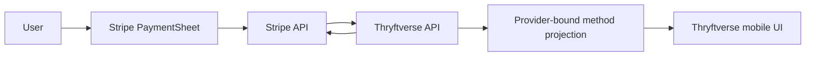
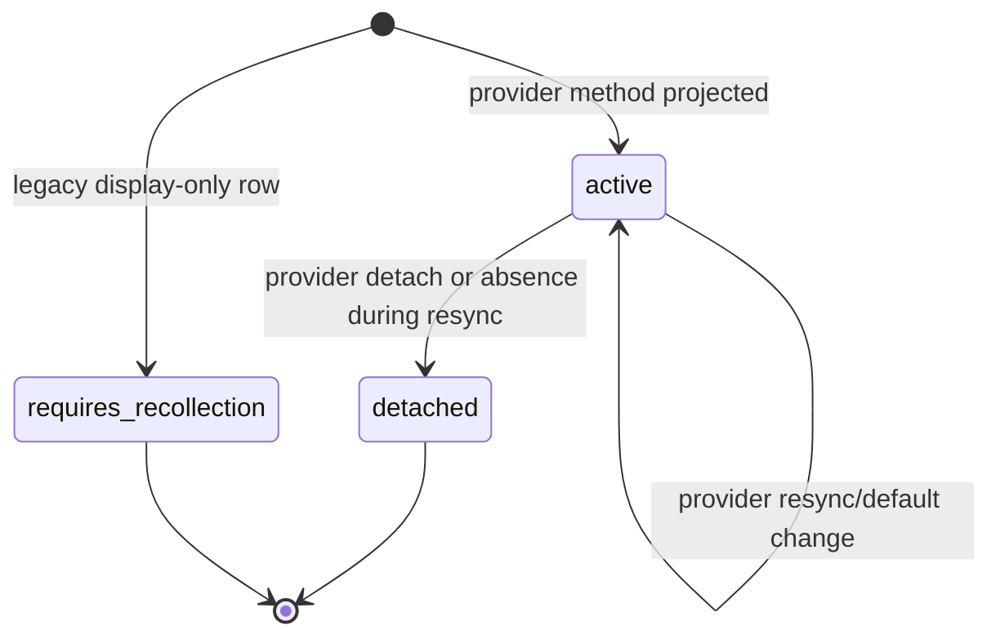

# ADR-001: Tokenised card-data boundary

- Status: accepted for implementation; provider-sandbox evidence pending
- Date: 2026-07-29
- First corridor: GB / GBP / Stripe

## Decision

Thryftverse mobile and API code must never collect or receive primary account
numbers, expiry input, CVC/CVV, magnetic-stripe data, or card verification
values.

Card entry is owned by Stripe's React Native PaymentSheet. The backend creates
the authenticated user's Stripe Customer, CustomerSession, SetupIntent, and
order PaymentIntent. The app receives only publishable configuration and client
secrets. Saved methods are projected from Stripe responses and identified by a
Stripe PaymentMethod reference.

Apple Pay and Google Pay are default-deny. They appear inside PaymentSheet only
when the backend capability flag is enabled and the native build contains the
corresponding merchant configuration.

## Data boundary

The SDK-to-Stripe edge may contain card data. Thryftverse app state, API
requests, logs, database rows, telemetry, and error reporting must not.

## Saved-method state machine

Historical legacy rows remain only to preserve order foreign keys. They are
never returned by the v2 method API and never qualify for checkout.

## Consequences

- A native development build is required for Stripe PaymentSheet and platform
  wallets.
- Users with legacy display-only cards must add a method again.
- Provider availability is a runtime dependency; there is no local saved-card
  fallback.
- Bank payout accounts are not customer payment methods and are intentionally
  excluded from this first corridor.

## Evidence still required

- Stripe test-mode proxy capture proving no raw card fields cross the
  Thryftverse API boundary.
- Visa, Mastercard, and American Express SetupIntent and payment scenarios.
- cancellation, 3DS/SCA failure, network retry, detach, and default-method
  scenarios.
- Apple Pay and Google Pay evidence from correctly provisioned native builds
  before either flag is enabled.
