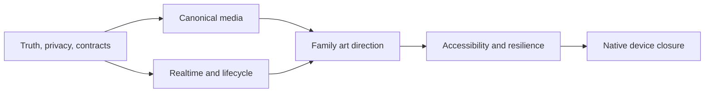

# Implementation Roadmap

## Phase 0 — Baseline and safety

Deliverables:

- clean branch from audited head;
- reproduced frontend/backend results;
- schema snapshots;
- feature flags/rollback plan;
- fixture inventory.

Exit: no uncertainty about baseline failures or migrations.

## Phase 1 — P0 truth and privacy

Work:

- remove Direct fabrication and status collapse;
- secure listing publication and Co-Own holdings;
- add Co-Own rights/dossier contract;
- implement Auction reserve and Buy Now order closure;
- add server-derived capabilities.

Exit: every enabled commercial action is backed by an authoritative contract; P0 privacy tests pass.

## Phase 2 — Canonical media

Work:

- canonical media schema across families;
- publication verification, limits, reorder and freeze/version;
- object-safe renderer, poster/error states, index continuity;
- Co-Own mixed media.

Exit: mixed image/video fixture works end-to-end in all applicable families.

## Phase 3 — Realtime and lifecycle closure

Work:

- Auction event versioning/resume;
- Co-Own atomic book and delta stream;
- explicit freshness/connection UI;
- order/payment/settlement/fulfilment states.

Exit: two-client and reconnect tests converge; no stale interface claims live/open status.

## Phase 4 — Family art direction

Work:

- Direct editorial composition;
- Auction bid/time instrument;
- Co-Own market/evidence instrument;
- reduce generic nested surfaces;
- author dark mode and large-text reflow.

Exit: unlabelled captures are recognizably different families and average at least 8/10 in internal review.

## Phase 5 — Accessibility, performance and resilience

Work:

- screen-reader semantics/announcements;
- target sizes/focus;
- reduced motion;
- media resource/cache budget;
- offline/partial failure/unknown-outcome recovery.

Exit: no critical accessibility issue; performance budgets pass on the lowest supported device.

## Phase 6 — Device and release closure

Work:

- runtime, database and native E2E;
- screenshot matrix and review;
- fix complete frontend suite;
- unskip applicable backend integration tests;
- populate final report and exception register.

Exit: every applicable acceptance item has linked evidence.

## Dependency map

## Release slices

If incremental release is needed:

1. ship truth/security corrections behind existing visuals;
2. ship media contract and viewer behind flags;
3. release Direct;
4. release Auction only with realtime/order closure;
5. release Co-Own only with rights/private position/live market closure.

Do not use feature flags to expose knowingly unsafe actions.

